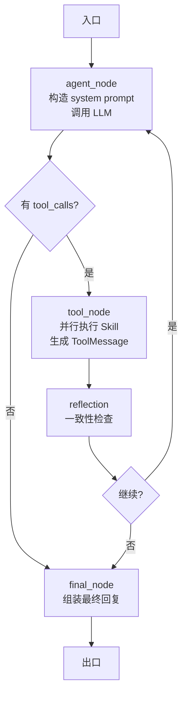

# 01 — Agent 平台架构

> 状态：草稿 | 维护：BlockShip | 关联：[02_Skill引擎与契约](./02_Skill引擎与契约.md)、[03_Context工程](./03_Context工程.md)、[04_Memory工程](./04_Memory工程.md)、[05_Prompt工程](./05_Prompt工程.md)

---

## 1. 边界定义

Agent 平台是 Farm Manager 的核心，由 6 个子域 + 4 个工程化支撑域组成：

| 子域 | 路径 | 职责 | 不负责 |
| --- | --- | --- | --- |
| **Application** | `agent/application/` | Use Case 编排：聊天、流式、每日建议、报告、历史、Smart Fill | HTTP request 细节、DB 表直接操作 |
| **Advisor（兼容入口）** | `agent/advisor.py` | Guardrails + 问候/待确认意图 + 编排 LangGraph | 业务逻辑 |
| **Runtime** | `agent/runtime/` | LangGraph 图工厂、节点、消息、状态、tool_executor、stream_events、quota | Prompt 版本治理、Context selector、Memory 存储 |
| **Planner** | `agent/planner/` | 意图识别、工具候选规划（含 `tool_selector.py` 兼容） | HTTP 路由、Prompt 模板、Memory 存储 |
| **Executor** | `agent/executor/` | Skill 调用、并行执行、参数校验、Pending Action、tool_calls 适配 | API 路由、Prompt 模板、Memory 存储 |
| **Reflector** | `agent/reflector/` | 写操作风险检查、工具结果一致性、daily_advice 反思、reflection trace | Runtime/Executor 内部策略 |
| **Response** | `agent/response/` | 结构化回复、SSE 事件、输出格式约束 | — |
| **Sessions** | `agent/sessions/` | 会话状态、Conversation 持久化适配 | — |
| **Ports** | `agent/ports.py` | Agent 与外部依赖（LLM、Memory、Trace）的端口定义 | 实现 |

支撑域：

| 支撑域 | 路径 | 职责 |
| --- | --- | --- |
| **Prompt 工程** | `prompt/` + `backend/prompts/snippets/` | Registry / Composer / Renderer / Replay / Cache |
| **Context 工程** | `context/` | Bundle / Selector / Budget / Compressor / Cache / Preload |
| **Memory 工程** | `memory/` | Short-term / Long-term / Retrieval / Consolidation / Observation |
| **Skills** | `agent/skills/` | 30+ 业务能力，按 `.claude/rules/skill-writing.md` 契约实现 |

## 2. Application 层（Use Case）

入口模块，API 层只调用 Use Case，不直接编排 Runtime。

| Use Case | 文件 | 用途 | 入口 API |
| --- | --- | --- | --- |
| `chat_use_case` | `chat_use_case.py` | 一次性同步对话 | `POST /api/v1/agent/chat` |
| `stream_chat_use_case` | `stream_chat_use_case.py` | 流式对话（SSE） | `POST /api/v1/agent/chat/stream` |
| `daily_advice_use_case` | `daily_advice_use_case.py` | 每日建议生成 | 内部任务 / `POST /api/v1/agent/advice` |
| `report_use_case` | `report_use_case.py` | 周期报告 | 内部任务 / Admin |
| `history_use_case` | `history_use_case.py` | 历史会话查询 | `GET /api/v1/agent/history` |
| `advice_use_case` | `advice_use_case.py` | 旧版兼容入口 | — |
| `context_invalidation` | `context_invalidation.py` | 上下文失效（写操作后刷新缓存） | 内部 |
| `context_memory` | `context_memory.py` | Use Case 层的 Context 与 Memory 适配 | 内部 |
| `skill_catalog` | `skill_catalog.py` | Skill 目录服务 | 内部 |
| `smart_fill` | `smart_fill.py` | 智能填写场景注册表 | `POST /api/v1/scenarios` |
| `session_flywheel` | `session_flywheel.py` | 会话级飞轮数据采集 | 内部 |

**约束**：
- Application 不直接读数据库表，通过 Service 或 Memory Service 端口。
- Application 不直接调 LLM，通过 Runtime 或 Advisor。
- Application 提交 Memory observation、Trace、Evaluation capture 是允许的。

## 3. Advisor（兼容入口）

`agent/advisor.py` 是历史入口，正在收敛到 Application。当前职责：

```
请求入口
  ├─ init_trace（创建 trace_id、session_id、turn_id）
  ├─ check_input（Guardrails：敏感词、超长、注入）
  ├─ classify_intent（问候 / 直接意图 / 多步任务 / 闲聊）
  │     ├─ 问候 → get_greeting_reply → 直接返回
  │     ├─ 闲聊 → 简单回复或路由到 chat skill
  │     └─ 直接意图 → 进入 Runtime
  ├─ handle_pending_action（检查是否有待确认动作）
  ├─ 调用 LangGraph 图（compile_advisor_graph）
  ├─ filter_output（敏感信息过滤）
  ├─ clear_trace
  └─ 返回结果
```

**未来收敛**：把 `compile_advisor_graph` 拆为 `runtime/graph_factory.py` + `runtime/nodes.py`，Advisor 只保留 Guardrails 和 Pending 编排。

## 4. Runtime（LangGraph 核心）

| 文件 | 职责 |
| --- | --- |
| `graph_factory.py` | 编译 LangGraph 图，单例缓存 |
| `nodes.py` | 节点实现：agent_node、tool_node、route_node、final_node |
| `state.py` | 图状态：messages、tool_calls、pending、reflection、metadata |
| `messages.py` | 消息适配：LangChain Message ↔ DB ConversationMessage |
| `tool_executor.py` | 工具执行节点：并行调用、错误处理、ToolMessage 适配 |
| `quota.py` | LLM 配额检查（token、调用次数、并发） |
| `final_prompt_budget.py` | 最终 system prompt 的 token 预算裁剪 |
| `llm_support.py` | LLM 调用辅助（超时、重试、降级） |
| `chat_fallbacks.py` | LLM 失败兜底回复 |
| `direct_routing.py` | 快速路由（已知意图跳过首次推理） |
| `reflection.py` | 反思节点接入 |
| `stream_events.py` | SSE 事件流生成 |
| `errors.py` | Runtime 错误定义 |

**节点流程**（伪图）：



## 5. Planner（意图与工具候选）

| 文件 | 职责 |
| --- | --- |
| `intent.py` | 意图分类：问候/记账/查询/规划/闲聊/未识别 |
| `models.py` | Planner 输入输出模型 |
| `tool_selector.py` | 工具候选选择（兼容入口，含规则匹配 + LLM 推理） |
| `tool_selection_rules.py` | 规则库：关键词 → 候选 Skill |

**输出**：`PlannerOutput(candidates: list[str], reasoning: str, confidence: float)`，候选 Skill 名称列表会绑定到 LLM 的 tools 参数，减少 token。

## 6. Executor（Skill 调用）

| 文件 | 职责 |
| --- | --- |
| `tool_calls.py` | LangChain tool_call 适配 |
| `pending_actions.py` | Pending Action：保存/确认/取消/过期 |
| `models.py` | Executor 输入输出模型 |

**写操作确认流程**：

```
LLM 决定调用 create_cost_record
  ↓
Executor 检查 skill.meta.permission == "write_confirm"
  ↓
是 → 创建 PendingAction（带完整参数 + 过期时间）
     → 返回确认话术
     → 用户点确认 → /pending/{id}/confirm → 真正执行 Skill
     → 用户点取消 → /pending/{id}/cancel → 丢弃
     → 超时 → 异步清理
否 → 直接执行 Skill
```

## 7. Reflector（反思）

| 文件 | 职责 |
| --- | --- |
| `service.py` | 反思服务入口 |
| `policy.py` | 反思策略：何时触发、检查项 |
| `checks.py` | 具体检查：写操作一致性、工具结果匹配、回复幻觉 |
| `daily_advice.py` | 每日建议反思 |
| `models.py` | 反思结果模型 |

**触发条件**：
- 任何写操作 Skill 调用后
- LLM 回复中提到「已记账/已创建/已删除」等动作动词
- Reflector 不阻塞主流程，但产出 reflection_trace 用于 DataFlywheel

## 8. 依赖矩阵（核心约束）

| 边界 | 可依赖 | 禁止依赖 |
| --- | --- | --- |
| `api/*.py` | Pydantic schema、Depends、application use case、模块 router | `app.memory`、`app.prompt`、`app.context` 直接 import |
| `agent/application/` | Auth/Farm 依赖、Context Builder、Prompt Composer、Runtime、Memory Service、Evaluation、Observability | HTTP request 细节、数据库表直接操作 |
| `agent/runtime/` | Runtime state、nodes、graph factory、tool executor 协议、Agent ports | Prompt 版本治理、Context selector 实现、Memory 存储 |
| `agent/planner/` | 工具候选、意图分类、Context 摘要 | HTTP 路由、Prompt 模板、Memory 存储 |
| `agent/executor/` | Skill registry、权限策略、参数校验、写操作确认 | API 路由、Prompt 模板、Memory 存储 |
| `agent/reflector/` | Skill 调用结果、ToolMessage、Pending 状态 | Runtime 内部状态机细节、API 路由 |
| `prompt/` | PromptInput、ContextBundle 摘要、版本配置、快照 | 数据库查询、Memory 存储 |
| `context/` | 业务 selector、Memory Service 接口、token budget | Prompt 版本治理、LLM Runtime 节点执行 |
| `memory/` | Memory models、schemas、retrieval、infra adapter | API 路由、Runtime 状态机细节 |
| `agent/skills/` | Skill schema、权限、执行适配、业务模块端口 | API request 对象、Prompt/Context 存储实现 |

CI 门禁：`scripts/check-layer-deps.sh` 检查 import 违规。

## 9. 与典型多 Agent 系统的对比

| 维度 | 典型多 Agent 系统 | Farm Manager |
| --- | --- | --- |
| Agent 形态 | Master + SubAgent（设备/场景） | 单 Master + 30+ Skill，无 SubAgent |
| 上下文压缩 | 三层（micro/auto/manual） | 三层（compressors/ + budget/ + cache/） |
| Memory | 外部 RAG 服务 | 内嵌 MemoryService（端口预留 RAG） |
| Pending | 未提及 | 一等公民，写操作必备 |
| Reflector | 未提及 | 一等公民，反幻觉 |
| DataFlywheel | 未提及 | 一等公民，从 P0 起 |
| 快慢思维 | 强（设备控制 < 500ms） | 弱（每日建议秒级，记账可秒级） |

## 10. 相关文档

- [02_Skill引擎与契约](./02_Skill引擎与契约.md)
- [03_Context工程](./03_Context工程.md)
- [04_Memory工程](./04_Memory工程.md)
- [05_Prompt工程](./05_Prompt工程.md)
- [06_数据飞轮与评测](./06_数据飞轮与评测.md)
- [03_接口协议/02_Agent内部接口](../03_接口协议/02_Agent内部接口.md)
- 现有：[../../docs/architecture/boundaries.md](../../docs/architecture/boundaries.md)、[../../docs/architecture/backend-architecture.md](../../docs/architecture/backend-architecture.md)
