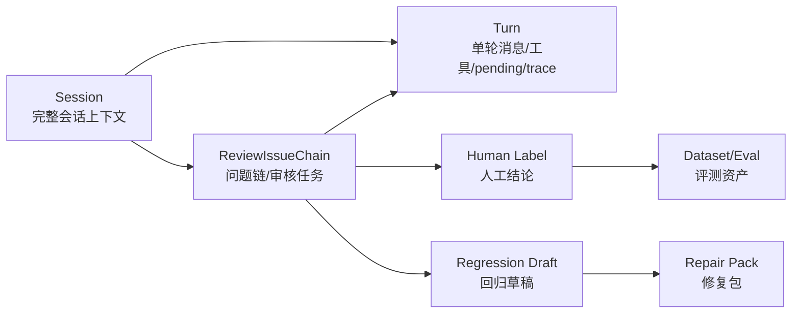
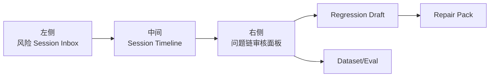
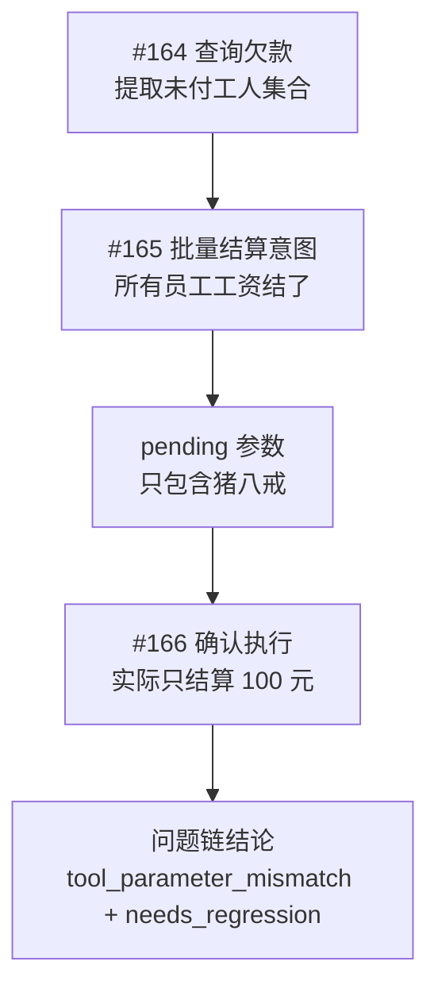
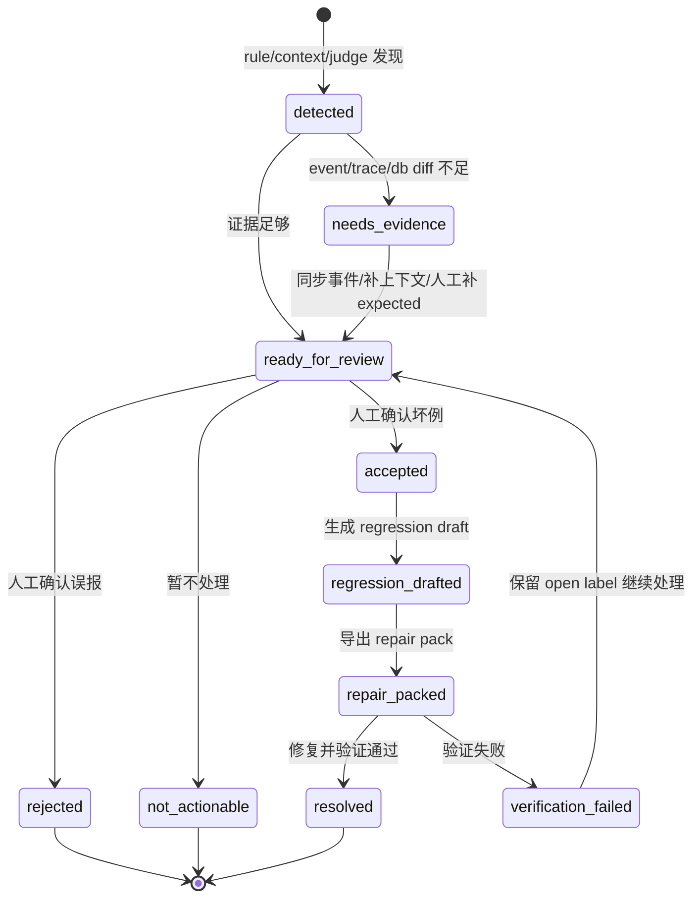
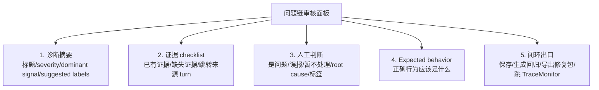

# 06 — 数据飞轮与评测

> 状态：草稿 | 维护：BlockShip | 关联：[01_Agent平台架构](./01_Agent平台架构.md)、权威 [../../docs/architecture/agent-data-flywheel-industrial-roadmap.md](../../docs/architecture/agent-data-flywheel-industrial-roadmap.md)

---

## 1. 为什么需要数据飞轮

Farm Manager 不是一次性交付的产品，而是持续进化的 AI 系统。每一轮真实对话都比评测集宝贵 10 倍且免费。**数据飞轮是从真实会话、trace、event log 和仿真失败中提取样本，经过规则候选 → LLM 预标注 → 人工确认 → 回归/评测/训练数据的闭环**。

这是中小团队对抗大厂的唯一路径。

## 2. 完成态（北极星）

工业级数据飞轮不是赞踩按钮，也不是日志列表。它是一条持续转动的数据链路：

```
真实会话 / Playground / Simulation 失败
  → MySQL 热索引 + JSONL 原始事件
  → 规则初筛
  → LLM 自动预标注
  → 人工确认和根因标注
  → Bad Case / Tool Selection / Pending Safety / SFT 数据集
  → 生成 regression / evaluation case
  → Simulation 回归运行
  → Evaluation 汇总趋势
  → 修 prompt / router / skill / pending plan
  → 新会话继续回流
```

四个硬要求：
- **快速发现**：自动捞出工具格式异常、幻觉执行、pending 漏拦截等坏例
- **证据完整**：每个样本能回溯 session_id、turn_id、request_id、trace、tool I/O、pending lifecycle、token、latency、prompt/model 版本
- **标注可信**：AI 预标注可用，最终真值必须来自人工确认或确定性规则
- **闭环可消费**：标注样本能进入 regression case、evaluation replay、router 训练、pending safety、SFT JSONL

## 3. 模块边界

| 模块 | 职责 | 不负责 |
| --- | --- | --- |
| **Playground** | 手工发起对话、复制 debug JSON、复现用户输入 | 批量样本治理 |
| **TraceMonitor** | 定位单次请求链路、节点 I/O 和耗时 | 标注队列和数据集版本管理 |
| **DataFlywheel** | 样本队列、根因标注、AI 预标注采纳、导出、生成 case 草稿 | 实际执行回归测试 |
| **Simulation** | 主动运行 regression case，验证当前 Agent 行为 | 真实会话样本筛选和人工标注 |
| **Evaluation** | 汇总通过率、工具选择准确率、pending 安全趋势、版本对比 | 单条 trace 调试 |
| **Prompt/Router/Skill** | 消费飞轮产出的修复信号并改进行为 | 直接写入标注真值 |

## 4. 数据源

| 数据源 | 示例 | 用途 |
| --- | --- | --- |
| **显式用户反馈** | 赞、踩、Retry、主动纠错 | 判断回复质量和用户满意度 |
| **隐式用户反馈** | 复制回答、继续追问、中途退出、重复问 | 辅助判断回答有用性 |
| **Agent 内部链路** | selected tools、actual tool calls、pending plan、tool error、token、latency | 定位技术根因和回归 case |
| **仿真与评测回流** | simulation failed、evaluation replay failed | 防回归 |

显式反馈稀疏，**不能作为唯一来源**。必须依赖 Agent 内部链路和仿真回流补齐覆盖率。

## 5. 自动标注三层

按可信度递增：

| 层 | 来源 | 可作为真值 |
| --- | --- | --- |
| 1. 规则候选 | `rule`（确定性事件 + 文本规则） | 仅高置信规则可入候选，真值仍建议人工确认 |
| 2. LLM 预标注 | `llm_judge`（读样本证据 + debug JSON，输出 quality + root_cause + severity + confidence + label + reason） | ❌ 不可直接作为真值 |
| 3. 人工最终标注 | `human`（采纳/修改/驳回 AI 建议） | ✅ 真值 |

**关键约束**：同一个模型不能既生产线上回复又把自己的评分作为最终真值。同模型 judge 只能作为预标注和排序信号。

## 6. 标签体系（固定枚举）

避免标签发散：

| 标签 | 含义 | 维度 |
| --- | --- | --- |
| `good_reply` | 好回复 | 输出 |
| `bad_reply` | 坏回复 | 输出 |
| `wrong_tool_selection` | 工具选错 | 决策 |
| `tool_parameter_mismatch` | 工具参数、实体、数量或作用域与用户意图/上下文不一致 | 决策 |
| `pending_missed` | pending 漏拦截 | 安全 |
| `hallucinated_execution` | 幻觉执行（回复说做了但 tool_call 没成功） | 一致性 |
| `tool_error_ignored` | 工具失败后回复仍称成功 | 一致性 |
| `off_topic` | 答非所问 | 输出 |
| `sensitive_info_leak` | 参数、提示词、内部信息泄露 | 安全 |
| `missing_wage` | 安排农事但工资缺失 | 业务规则 |
| `disabled_worker_used` | 禁用工人被使用 | 业务规则 |
| `unclear_intent` | 用户输入不足 | 输入 |
| `not_actionable` | 暂不处理 | 元 |
| `needs_regression` | 需沉淀为回归用例 | 元 |

标注时区分：
- 用户输入是否可处理（如 `unclear_intent`）
- Agent 输出是否合格（如 `bad_reply`、`hallucinated_execution`）

## 7. 存储与资源约束

小服务器部署轻量架构：

| 存储 | 用途 | 查询模式 |
| --- | --- | --- |
| **MySQL** | 热索引、turn 元数据、标签、case draft、dataset 版本、评测摘要 | 列表页 |
| **JSONL** | 原始事件、tool payload、trace segment、debug evidence | 详情页（按 event_file + seq range 局部读） |

**禁止**：
- 列表页扫全量 JSONL
- 引入 Kafka / ClickHouse / Mongo / 数据湖
- 同步导出大体积数据（必须异步任务）

数据保留：
- 热索引保留 90 天，列表检索
- 原始 JSONL 按日期/farm/session 分区，保留 1 年
- 导出训练数据前必须脱敏

## 8. 分阶段演进

### P0 — 证据完整化（当前）

目标：每轮会话能被复盘。

交付：
- `agent_turns`、`conversation_messages`、trace、JSONL event log 对齐
- debug export v2（导出本轮 skill/router/tool/pending/messages 上下文）
- pending plan 持久化（重启后仍能确认/取消/过期）
- DataFlywheel 详情页展示缺失证据段

验收：
- 一条多意图对话能从 DataFlywheel 跳 TraceMonitor，复制完整 debug JSON
- 写操作是否经过 pending、是否执行成功、是否影响数据库可被复查

### P1 — 人工标注闭环

目标：坏例能进入回归草稿。

交付：
- DataFlywheel 样本队列、详情、固定标签、备注、session 级标注
- 规则候选队列：工具格式异常、工具失败、幻觉执行、pending 漏拦截、写操作误触发
- 上下文一致性候选：工具参数实体、数量、作用域与前文候选集合不一致时自动入队
- 当前样本 JSONL 导出
- `case draft` 生成（含 expected skills、expected pending、confirmation flow、reply assertions、expected db diff）
- 人工确认后加入 Simulation 或 Evaluation replay

### P2 — AI 自动预标注

目标：降低人工标注成本，不牺牲真值质量。

交付：
- LLM judge prompt + 版本管理
- 预标注 API（输入样本证据 + 前后文窗口 + 工具参数 + pending 动作 + 可选数据库差异，输出 suggested labels / root cause / severity / confidence / reason / recommended fix）
- 前端展示「AI 预判」，支持采纳/修改/驳回
- 标注来源记录（`rule` / `llm_judge` / `human`），保留 judge model + prompt version
- 低置信度入人工优先队列，高置信规则入快速确认队列

### P3 — Dataset 与仿真评测闭环

目标：修复效果可量化、可防回归。

交付：
- 数据集版本管理（dataset_name / version / split / source_sample_id / label_source）
- DB-backed simulation cases（避免写部署包内 JSON）
- Simulation 失败结果自动回流到 DataFlywheel
- Evaluation 汇总版本趋势（通过率、工具选择准确率、pending 漏拦截率、幻觉执行率、token/latency）
- Prompt/router/skill 改动必须跑核心 regression suite

### P4 — 训练与调优出口

目标：高质量标注数据 → 模型 / prompt / router / skill 改进输入。

交付：
- SFT JSONL 导出（user input + 必要上下文 + tool result + 人工修正回复）
- Router 训练/评测样本（input + expected tools + rejected tools + reason）
- Pending safety 数据集（写操作 + 确认话术 + 应拦截/应执行 + 期望 db diff）
- Prompt A/B 与 pairwise 回复对比
- 修复建议归档（每个 bad case 关联修复 PR / prompt version / skill version）

## 9. Discovery Layer 与风险发现

> 状态：设计中 | 维护：BlockShip | 关联：[02_系统功能及技术架构总设计 § 5.7](../00_预设计/02_系统功能及技术架构总设计.md)

### 9.1 问题背景

农场场景下，**95%+ 的真实会话是正常会话**（"你好"、"今天天气怎么样"、"你是谁"、"我喜欢你"）。当前 DataFlywheel 默认按时间倒序展示全部会话，标注员需要从大量正常会话中人工捞坏例，导致：

- 标注效率低：每日标注 < 20 条
- 覆盖率差：发现的问题偏向"显眼"的，遗漏"细粒度"的
- 反馈延迟：从会话发生到被发现，平均 > 3 天

目标：**从 10000 条会话中自动找出最值得标注的 100 条**，让标注员默认看风险最高的，而不是最新的。

### 9.2 典型反例：单 turn 判断不够

`repair-manual_triage-2ced95bdeea1` 暴露了当前工作台最核心的问题：样本能被导出为 repair pack，但系统并没有自动解释它为什么坏，也没有给出可直接回归的断言。

证据链：

1. 前文 turn #164 中，系统列出未付人工：诸葛四郎、李海、朱7、李2、李3、李一凡、猪八戒，共 750 元。
2. 用户 turn #165 说「把所有员工工资结了」，这是对前文未付人工集合的全集结算意图。
3. Agent 输出 pending：「确认结算人工：猪八戒」，pending 参数为 `{ "内容": "猪八戒" }`。
4. 用户确认后，只结算了猪八戒 100 元。

这类错误不是 `tool_error_ignored`、`hallucinated_execution` 或 `missing_wage`。工具选对了，pending 也出现了，但**工具参数的实体/数量/作用域错了**：用户要「所有员工」，系统执行成「单个员工」。因此当前规则候选很难命中；如果 AI 预判只看当前 turn，也只能看到「用户说所有员工，回复说猪八戒」，无法知道前文确实存在 7 个未付工人，更难判断这是高风险写操作参数收窄。

结论：Discovery Layer 不能只做风险排序，必须升级为**发现 + 诊断 + 回归草稿生成**。风险分数告诉标注员先看哪条，诊断证据告诉标注员为什么坏，回归草稿告诉工程侧怎么修。

### 9.3 核心设计：三类信号 + 取 max 评分

不做复杂在线学习。MVP 仍然保持轻量，但信号从两类升级为三类：

```
全部 session / turn
      │
      ▼
┌──────────────────────────┐
│ Rule Engine              │  ← 确定性规则：工具失败、幻觉执行、pending 缺失
└────────────┬─────────────┘
             │
             ▼
┌──────────────────────────┐
│ Context Analyzer          │  ← 上下文一致性：实体集合、数量、作用域、参数差异
└────────────┬─────────────┘
             │
             ▼
┌──────────────────────────┐
│ LLM Judge Worker          │  ← 读证据包做预标注，不写最终真值
└────────────┬─────────────┘
             │
             ▼
risk_score = max(rule_score, context_score, judge_bad_prob)
             │
             ▼
风险队列 + 诊断工作台 + repair pack 草稿
```

三类信号分工：

| 信号 | 擅长发现 | 不擅长 |
| --- | --- | --- |
| Rule Engine | 工具失败、空回复、敏感信息、pending 缺失、明确关键词规则 | 需要跨轮理解的语义错配 |
| Context Analyzer | 工具参数与用户意图/前文候选集合不一致，例如「所有员工」变成单人 | 开放式回答质量 |
| LLM Judge | 答非所问、意图理解错、证据综合、给出 root cause 和 recommended fix | 作为最终真值、直接驱动线上修复 |

### 9.4 风险评分与诊断输出

```python
def compute_risk(turn_context) -> dict:
    rule_hits = match_rules(turn_context)
    context_hits = analyze_context_consistency(turn_context)
    judge = run_or_read_judge(turn_context)

    rule_score = max([hit.weight for hit in rule_hits], default=0.0)
    context_score = max([hit.weight for hit in context_hits], default=0.0)
    judge_score = judge.bad_prob or 0.0
    score = max(rule_score, context_score, judge_score)

    return {
        "score": score,
        "dominant_signal": dominant(rule_score, context_score, judge_score),
        "rule_hits": [hit.id for hit in rule_hits],
        "context_hits": [hit.id for hit in context_hits],
        "judge_issue_type": judge.issue_type,
        "diagnosis": build_human_readable_diagnosis(
            rule_hits=rule_hits,
            context_hits=context_hits,
            judge=judge,
        ),
    }
```

设计取舍：

- **取 max 而非加权求和**：一个强问题就足以进入队列，避免被多个弱信号稀释。
- **诊断输出与风险分数分离**：分数负责排序，诊断负责标注和修复，不把 `0.95` 这种数字当成结论。
- **先规则化上下文错配，不急着训练模型**：先覆盖最常见的高风险写操作，如工资结算、作业安排、成本入账、删除/禁用实体。

### 9.5 Context Analyzer

Context Analyzer 是当前最需要补的一层。它不替代 LLM，而是把跨轮证据结构化，供规则、Judge、人工和 regression draft 共用。

输入证据包：

| 字段 | 来源 | 用途 |
| --- | --- | --- |
| `current_user_input` | 当前 turn user message | 判断显式意图，如「所有」「全部」「每个」「这些」 |
| `current_assistant_reply` | 当前 turn assistant message | 检查确认话术是否改变作用域 |
| `selected_tools` / `actual_tools` | router / events / trace | 区分工具选错还是参数错 |
| `pending_action.params` | pending action / pending plan | 检查待确认参数是否与用户意图一致 |
| `context_window` | 同 session 前 N 轮消息 | 提取前文实体集合、数量、用户指代对象 |
| `tool_result_facts` | 前文工具结果或回复中的结构化摘要 | 提取未付工人、欠款、地块、作物、农资等候选集合 |
| `db_diff`（可选） | 确认执行前后差异 | 判断实际只影响了哪些实体 |

第一批上下文规则：

| 规则 | 命中条件 | 标签 |
| --- | --- | --- |
| `bulk_intent_narrowed_to_single_entity` | 用户出现「所有/全部/每个/都」，前文候选集合数量 > 1，但 pending 参数或执行结果只有 1 个实体 | `tool_parameter_mismatch` |
| `referential_scope_lost` | 用户用「这些/他们/上面那些」指代前文集合，但参数只保留最后一个或任意一个实体 | `tool_parameter_mismatch` |
| `confirmation_text_contradicts_intent` | 确认话术复述了用户全集意图，但操作标题/参数是单个实体 | `tool_parameter_mismatch` |
| `db_diff_smaller_than_requested_scope` | 用户请求批量写操作，执行后 db diff 只影响部分实体 | `tool_parameter_mismatch` |

对 `repair-manual_triage-2ced95bdeea1`，期望自动生成的候选应类似：

```json
{
  "type": "bulk_intent_narrowed_to_single_entity",
  "severity": "critical",
  "suggested_label": "tool_parameter_mismatch",
  "reason": "用户要求结算所有员工工资，前文未付工人共 7 人，但 pending 参数只包含猪八戒。",
  "evidence": {
    "requested_scope": "all_workers",
    "context_entity_count": 7,
    "pending_entity_count": 1,
    "pending_entities": ["猪八戒"]
  }
}
```

### 9.6 规则引擎

规则引擎继续保留热更新 YAML 和轻量 DSL，但不要把所有问题都塞成文本关键词。规则分两类：

| 类型 | 示例 | 执行位置 |
| --- | --- | --- |
| 单 turn 确定性规则 | `tool_error_ignored`、`hallucinated_execution`、`weather_without_search`、`missing_pending_confirmation` | Rule Engine |
| 上下文一致性规则 | `bulk_intent_narrowed_to_single_entity`、`referential_scope_lost`、`confirmation_text_contradicts_intent` | Context Analyzer |

规则与 § 6 标签体系对应：

- **P0 规则** → `hallucinated_execution` / `tool_error_ignored` / `pending_missed` / `tool_parameter_mismatch` / `sensitive_info_leak`
- **P1 规则** → `wrong_tool_selection` / `off_topic` / `unclear_intent`

规则候选的输出必须包含 `reason` 和 `evidence`，否则工作台只会显示一个分数，标注员仍然需要重新查整条链路。

### 9.7 LLM Judge

| 项 | 值 |
| --- | --- |
| 模型 | 成本敏感模型优先，例如 lightweight judge model |
| 调度 | 每天 02:00 cron 跑前 24h 未标注样本；高风险写操作可按需即时预判 |
| 并发 | 32 并发，按成本阈值自动降级 |
| 成本 | 月成本上限固定，超限切 rule + context only |

Judge 输入不能只给当前 turn。必须使用统一 evidence pack：

```json
{
  "sample": {
    "user_input": "把所有员工工资结了",
    "assistant_reply": "确认结算人工：猪八戒...",
    "selected_tools": ["settle_labor_payment"],
    "actual_tools": ["settle_labor_payment"]
  },
  "context_window": [
    {
      "role": "assistant",
      "content": "未付人工：诸葛四郎、李海、朱7、李2、李3、李一凡、猪八戒..."
    }
  ],
  "pending_action": {
    "skill_name": "settle_labor_payment",
    "params": { "内容": "猪八戒" }
  },
  "issue_candidates": [
    {
      "type": "bulk_intent_narrowed_to_single_entity",
      "suggested_label": "tool_parameter_mismatch"
    }
  ]
}
```

Judge 输出：

```json
{
  "labels": ["tool_parameter_mismatch", "needs_regression"],
  "root_cause": "批量结算意图被参数抽取收窄为单个工人。",
  "severity": "critical",
  "confidence": 0.92,
  "reason": "前文存在 7 个未付工人，用户要求所有员工，pending 只包含猪八戒。",
  "recommended_fix": "参数抽取和 pending 确认必须保留批量作用域，无法批量执行时应追问或列出待结算清单。"
}
```

**Judge 结果不能作为最终真值**，仅作为 risk_score、root cause 建议和 repair pack 草稿的输入。最终真值仍来自人工标注（与 § 5 一致）。

### 9.8 风险队列与工作台改造

**后端**：`agent_turns` 或样本热索引保留 `risk_score`、`rule_score`、`context_score`、`judge_bad_prob`、`risk_dominant_signal`、`issue_candidates`。

**工作台 5 处改动**（保留现有 Tab，但让标注员默认看到问题解释）：

1. **默认排序**：`created_at DESC` → `risk_score DESC, created_at DESC`。
2. **新增开关**：隐藏低风险（`risk_score < 0.3`）。
3. **卡片展示**：风险分数 + 主导信号（rule / context / judge）。
4. **诊断摘要**：直接展示「为什么系统认为它坏」，例如「全集结算被收窄为单人」。
5. **回归草稿检查**：当 `regression_ready=false` 时，展示缺失断言并允许人工补 expected behavior。

工作台应该从“标标签页面”升级为“分诊台”：

| 区域 | 必须展示 |
| --- | --- |
| 当前 turn | 用户输入、助手回复、工具选择、pending 参数 |
| 上下文窗口 | 前 N 轮关键消息，尤其是实体集合来源 |
| 规则/上下文候选 | 命中规则、证据、建议标签、置信度 |
| AI 预判 | labels、root_cause、severity、reason、recommended_fix |
| 人工动作 | 采纳/修改/驳回、补 expected behavior、生成/更新 regression draft |

### 9.9 工作量与上线节奏

| 阶段 | 内容 | 工作量 |
| --- | --- | --- |
| D1 | 热索引补 `context_score` / `risk_dominant_signal` / `issue_candidates` | 0.5 人日 |
| D2 | Rule Engine 保持现有规则，补候选输出 reason/evidence | 0.5 人日 |
| D3 | Context Analyzer v1：批量意图、指代作用域、pending 参数一致性 | 1.5 人日 |
| D4 | Judge evidence pack 升级：前后文窗口 + pending 参数 + context hits | 1 人日 |
| D5 | 工作台诊断视图：上下文证据、候选解释、回归草稿缺口 | 1.5 人日 |
| D6 | 灰度 + 用 repair pack 校准规则权重和误判样本 | 0.5 人日 |
| **合计** | **MVP** | **5.5 人日** |

### 9.10 与分阶段演进（§ 8）的关系

Discovery Layer 是 **P2 AI 自动预标注**的核心交付之一。原 P2 描述的「LLM 预标注 + 标注来源记录」是 Discovery Layer 的下半部分（标注侧），上半部分（发现侧）由本节补充：

| 能力 | 原 P2 描述 | Discovery Layer 补充 |
| --- | --- | --- |
| 规则候选队列 | 已描述 | ✅ 复用，作为 risk_score 的 rule 信号源 |
| LLM 预标注 API | 已描述 | ✅ 复用，作为 risk_score 的 judge 信号源 |
| Context Analyzer | ❌ 未描述 | ✅ 新增，作为 risk_score 的 context 信号源 |
| 风险评分公式 | ❌ 未描述 | ✅ 新增，取 rule/context/judge 三者 max |
| 默认按风险排序 | ❌ 未描述 | ✅ 新增 |
| 诊断工作台 | ❌ 未描述 | ✅ 新增，让标注员看到 why 和 evidence |
| 回归草稿缺口 | P1/P3 有提及 | ✅ 新增，在 `regression_ready=false` 时提示补哪些断言 |

### 9.11 何时升级到 V2（聚类）

**触发条件（满足任一）：**

- 标注累积 1000+ 条
- 发现"重复标注同一类问题"频率高
- Judge 误判率 > 30%

**V2 只加一个能力**：HDBSCAN 聚类 + 简单 embedding，让标注员"标一条影响一片"。其他不做。

### 9.12 关键设计约束

| 约束 | 说明 |
| --- | --- |
| **不引入新基础设施** | 复用 Postgres + cron + 现有 LLM client，不引入 Kafka/Flink/向量库 |
| **Judge 不能作为真值** | 与 § 5 一致，最终真值仍需人工确认 |
| **规则可热更新** | 规则配置走配置中心，不发版 |
| **成本上限** | Judge 月成本 ≤ $200，超限自动降级到规则-only 模式 |
| **上下文窗口有边界** | 默认取当前 turn 前 3-5 轮和相关 tool result 摘要，避免把整段 session 塞给 Judge |

## 10. Daily Review Inbox 与问题链工作台

> 目标：飞轮默认不是日志浏览器，而是每日质检待办。标注员打开页面后先看到最该处理的风险 session，在完整上下文里审核问题链，最后沉淀 expected behavior、regression case 和 repair pack。

外部参考模式：

- LangSmith 使用 Annotation Queues 把 runs 组织成人工审核任务，队列是待办入口，不是全量日志表。
- Langfuse 支持对 traces、observations、sessions、dataset runs 打分；session 用来聚合同一多轮交互。
- Braintrust human review 支持 categorical scores、expected values、comments，人工判断会变成可评测资产。
- Humanloop 支持从 production logs 创建 dataset，再进入 eval 流程。

因此 Farm Manager 的主链路应是：

```text
生产会话 → 风险 Session Inbox → 问题链审核 → expected behavior → regression / repair pack / dataset
```

而不是：

```text
全部 turn 表格 → 点一行 → 看一堆日志字段 → 人工猜上下文
```

### 10.1 核心对象：ReviewIssueChain

真正的审核对象不是孤立 turn，也不是整个 session，而是 **ReviewIssueChain**：一个 session 内围绕某个风险点形成的相关 turn 集合。

典型例子：

1. #164：用户问欠谁钱，系统列出 7 个未付工人。
2. #165：用户说「把所有员工工资结了」，Agent 把全集结算意图收窄为「猪八戒」。
3. #166：用户确认后只结算猪八戒 100 元。

这三轮合起来才是坏例。只看 #165 会缺上下文，只看整个 session 又太粗。

对象关系：



`ReviewIssueChain` 回答 5 个问题：

- 这条问题是什么？
- 它发生在哪个 session？
- 哪些 turn 组成了它？
- 系统为什么认为它值得审核？
- 人工最终判断和 expected behavior 是什么？

### 10.2 建议数据结构

```ts
type ReviewIssueChain = {
  chain_id: string;
  farm_id: number;
  session_id: string;

  title: string; // 例如：工资结算参数错配
  status:
    | 'detected'
    | 'needs_evidence'
    | 'ready_for_review'
    | 'accepted'
    | 'rejected'
    | 'not_actionable'
    | 'regression_drafted'
    | 'repair_packed'
    | 'resolved'
    | 'verification_failed';

  severity: 'P0' | 'P1' | 'P2';
  dominant_signal: 'rule' | 'context' | 'judge' | 'evidence_missing';

  trigger_turn_id: number;
  context_turn_ids: number[];
  result_turn_ids: number[];
  unrelated_turn_ids?: number[];

  candidate_type: string; // 例如 bulk_intent_narrowed_to_single_entity
  suggested_labels: DataFlywheelLabel[];

  diagnosis: {
    summary: string;
    reason: string;
    evidence: Array<{
      key: string;
      label: string;
      value: string;
      source_turn_id?: number;
      status: 'present' | 'missing' | 'needs_human';
    }>;
  };

  ai_judge?: {
    labels: DataFlywheelLabel[];
    root_cause: string;
    confidence: number;
    reason: string;
    recommended_fix?: string;
    model: string;
    prompt_version: string;
  };

  human_review?: {
    final_labels: DataFlywheelLabel[];
    root_cause: string;
    expected_behavior: string;
    comment?: string;
    reviewer_id: string;
    reviewed_at: string;
  };

  regression?: {
    ready: boolean;
    missing_assertions: string[];
    draft_id?: string;
  };

  repair?: {
    fix_target?: string;
    pack_id?: string;
    resolved_at?: string;
  };
};
```

兼容策略：

- `agent_turns` 保留，继续作为最小证据单元。
- `AgentDataFlywheelLabel` 保留，但允许 `chain_id` 作为新的标注目标。
- `issue_candidates` 从 turn 级候选升级为 chain candidate。
- `repair_candidate` 从单 sample 生成，升级为从 chain 生成。
- `case draft` 的 source 从 `sample_id` 扩展为 `chain_id + related_turn_ids`。

MVP 可以先不建复杂表，使用“虚拟问题链”：围绕候选 turn 自动取前后相关 turn，在人工保存后再持久化 `chain_id`。

### 10.3 默认首页：每日质检

默认首页不再是 `全部 turn`，而是 **每日质检**。页面是三栏：



左侧：风险 Session Inbox

每张 session 卡片显示：

- session id / 用户输入摘要
- 风险最高的问题链
- P0/P1
- 候选链数量
- 证据状态：完整 / 缺 event / 缺 trace / 缺 db diff
- 主导信号：rule / context / judge / evidence_missing
- 当前处理状态：待审 / 补证据 / 已采纳 / 已驳回 / 已进入修复
- 下一步动作：审核链 / 补证据 / 驳回候选 / 生成回归

示例：

```text
playground-178212...
P0 · 1 条问题链 · 证据缺失
工资结算参数错配
#164 → #165 → #166
下一步：补 event/db diff 后审核
```

中间：Session Timeline

- 展示完整会话时间线。
- 当前问题链高亮。
- 上下文来源 turn 标绿色。
- 触发 turn 标蓝色。
- 结果 turn 标黄色或红色。
- 无关 turn 折叠或弱化。
- 每个 turn 默认只展示核心消息 + 工具/pending 摘要，详细 trace 放入折叠层。

右侧：问题链审核面板

固定顺序：

1. 诊断摘要。
2. 证据 checklist。
3. 人工判断。
4. expected behavior。
5. 闭环出口。

右侧不再堆字段，而是一个审核表单。

### 10.4 问题链生成方式

MVP 与目标态分层：

| 阶段 | 方式 | 说明 |
| --- | --- | --- |
| MVP | 自动上下文窗口 | 围绕候选 turn 取前 1-3 轮、后 1-2 轮，保证立刻可用 |
| V1 | 人工增删相关 turn | 标注员可以把无关 turn 移出问题链，或把遗漏 turn 加入 |
| V2 | 语义任务链 | Context Analyzer 识别「查询实体集合 → 写操作意图 → pending → 执行结果」 |

语义任务链示例：



### 10.5 状态机



关键规则：

- 没有 `expected_behavior`，不能生成 regression draft。
- `needs_evidence` 状态不能导出 repair pack。
- AI Judge 只能预填 root cause 和 reason，不能自动 accepted。
- 如果 `context_turn_ids` 为空，但 `candidate_type` 是上下文类问题，必须提示“缺上下文证据”。
- 如果人工驳回候选，系统要记录误报原因，用于调规则和 judge。

### 10.6 审核面板信息架构



对 `repair-manual_triage-2ced95bdeea1`，右侧应展示：

- 诊断摘要：批量结算意图被收窄为单个工人。
- 证据 checklist：
  - 已有：用户批量意图「所有员工」。
  - 已有：pending 参数「猪八戒」。
  - 缺失：前文实体集合或 db diff 时提示补证据。
- root cause：`tool_parameter_mismatch`。
- expected behavior：保留所有未付工人的批量作用域；工具不支持批量时应追问或列清单。
- 出口：生成 regression draft，然后导出 repair pack。

### 10.7 页面入口重构

现有 tab 建议收敛为：

| 新入口 | 来源 | 定位 |
| --- | --- | --- |
| 每日质检 | 新默认首页 | 风险 Session Inbox + 问题链审核 |
| 高级搜索 | 原样本队列 / 全部 turn / 全部 session | 查 request_id、session_id、时间范围、原始样本 |
| 修复包 | 原修复包 | repair pack 列表和状态管理 |
| 数据集/评测 | Simulation / Evaluation | dataset、regression、评测趋势 |

降级规则：

- `全部 turn`：降级为高级搜索，不作为默认首页。
- `问题候选`：成为每日质检的候选来源，不作为独立主 tab。
- `Session 复盘`：成为每日质检中间区域。
- `Turn 审核`：成为右侧审核面板或单 turn 展开详情。
- `修复包`：保留为闭环出口。
- `Evaluation`：保留为趋势和版本对比，不参与人工审核主流程。

### 10.8 MVP 切分

MVP 不要一口气做完整语义任务链，先做“好用的壳 + 自动上下文窗口”。

| 阶段 | 交付 | 验收 |
| --- | --- | --- |
| MVP 1 | 默认进入每日质检，左侧按 session 聚合风险 turn | 打开页面能看到今天最该处理的风险 session |
| MVP 2 | 虚拟问题链：trigger/context/result turns | 点击 session 后能在 timeline 里看到高亮问题链 |
| MVP 3 | 右侧审核面板：诊断、证据 checklist、root cause、expected behavior | 标注员知道为什么是候选、缺什么证据、正确行为是什么 |
| MVP 4 | 闭环出口：expected → regression draft → repair pack | 没有 expected 不能生成回归；证据不足不能导出修复包 |
| V2 | 语义任务链 + 聚类 | 系统自动识别实体集合、批量意图、pending 参数收窄、db diff 不一致 |

这样切的原因：当前最大问题不是缺复杂模型，而是工作台思维模型错了。

```text
当前：全部 turn → 右侧日志详情 → 人自己猜上下文
目标：风险 session → 问题链 → 上下文证据 → expected → 回归/修复
```

### 10.9 标注员操作说明

> 当前实现状态：`redesign-dataflywheel-review-workbench` 已落地 MVP。默认入口、虚拟问题链、人工审核持久化、regression draft 和 ReviewIssueChain repair pack 出口已打通；语义任务链识别和聚类仍属于后续 V2。

标注员每天处理一条问题链的标准流程：

1. 打开 DataFlywheel，默认进入 **每日质检**，优先处理左侧 `P0`、`needs_evidence` 或 `ready_for_review` 的风险 session。
2. 点击 session 卡片，系统自动打开最高风险 `ReviewIssueChain`。左侧卡片用于回答“先处理哪条”，不要从全部 turn 表格开始找问题。
3. 在中间 **Session Timeline** 看完整上下文。`trigger` 是风险 turn，`context` 是前文来源，`result` 是确认或执行结果；无关 turn 会弱化。
4. 如果自动窗口不准确，人工把 turn 加入或移出 `context/result`。同一个 turn 不能同时属于 context 和 result。
5. 在右侧先看诊断摘要和证据 checklist。证据项可以跳转到来源 turn；展开 turn 可看 messages、tools、pending lifecycle、router JSON 和 trace/debug 摘要。
6. 选择人工判断：
   - `accepted`：确认坏例，必须填写 root cause、final labels 和 expected behavior。
   - `rejected`：误报，必须填写误报原因，用于后续调规则或 judge。
   - `needs_evidence`：缺 event、trace、db diff 或上下文证据，先记录缺失项，不能导出 repair pack。
   - `not_actionable`：暂不处理，但仍保留处理状态，避免反复进入待办。
7. 保存后，inbox 会刷新已保存状态并进入下一条风险链。`accepted` 且具备 expected behavior 的链可生成 regression draft；`accepted + regression-ready` 的链可导出 repair pack。

对 `repair-manual_triage-2ced95bdeea1` 这类问题，标注员不应只标记单个 turn。正确处理方式是把「前文未付工人集合」设为 context，把「把所有员工工资结了」设为 trigger，把「确认后只结算猪八戒」设为 result，然后填写：

- root cause：批量结算意图被参数抽取收窄为单个工人。
- final labels：`wrong_tool_selection`、`needs_regression`。
- expected behavior：保留所有未结算工人的批量作用域；如果工具不支持批量，应追问或逐项确认，而不是默认只选一个人。

## 11. Evaluation 关键指标

| 指标 | 含义 | 目标 |
| --- | --- | --- |
| `pass_rate` | 通过率（replay 结果与 expected 一致） | ≥ 95% |
| `tool_selection_accuracy` | 工具选择准确率 | ≥ 90% |
| `pending_missed_rate` | pending 漏拦截率 | ≤ 2% |
| `hallucinated_execution_rate` | 幻觉执行率 | ≤ 1% |
| `parameter_mismatch_rate` | 工具参数/作用域与用户意图不一致率 | 持续下降，P0 样本 0 容忍 |
| `avg_token` | 平均 token 消耗 | 持续下降 |
| `avg_latency_p50` / `avg_latency_p95` | 延迟分位 | p95 ≤ 2s |
| `human_override_rate` | 人工干预率（采纳率 + 修改率） | ≤ 30% |
| `regression_ready_rate` | bad case 自动生成可审查回归草稿的比例 | ≥ 80% |

## 12. 当前状态

- ✅ DataFlywheel 列表 / 详情 / 标注 / case draft 基础
- ✅ Daily Review Inbox 默认入口（按风险 session 分组，而不是默认平铺全部 turn）
- ✅ ReviewIssueChain MVP（trigger/context/result turns、人工 related turn 调整、chain 状态持久化）
- ✅ 判断流程优先审核面板（诊断、证据 checklist、root cause、expected、保存并下一条）
- ✅ ReviewIssueChain → regression draft（保留 chain_id、related turns、expected behavior、root cause、quality labels）
- ✅ ReviewIssueChain → repair pack（仅 accepted + regression-ready，可追溯 source_chain_ids 和相关 turns）
- ✅ TraceMonitor 单 trace 详情
- ✅ Simulation 基础跑测
- ✅ Evaluation 报告骨架（chain-derived replay case 保留 `chain_id` 和 related turns）
- 🚧 规则候选队列（待落地）
- 🚧 Context Analyzer（待落地：批量意图、上下文指代、pending 参数一致性）
- 🚧 LLM 预标注 API（待落地）
- 🚧 Simulation 失败 → DataFlywheel 回流（待打通）
- 🚧 Dataset 版本管理（待落地）
- 🚧 SFT 导出（待落地）

## 13. Admin Web 页面对应

| 页面 | 路径 | 用途 |
| --- | --- | --- |
| DataFlywheel | `admin-web/src/pages/DataFlywheel/` | 每日质检、风险 Session Inbox、问题链审核、高级搜索、修复包入口 |
| TraceMonitor | `admin-web/src/pages/TraceMonitor/` | 单 trace 链路 |
| Simulation | `admin-web/src/pages/Simulation/` | 回归执行 + 结果 |
| PromptInspector | `admin-web/src/pages/PromptInspector/` | Prompt 版本 + replay |
| SkillRegistry | `admin-web/src/pages/SkillRegistry/` | Skill 注册表 + 触发词 |
| TokenDashboard | `admin-web/src/pages/TokenDashboard/` | Token 消耗监控 |

## 14. 相关文档

- [01_Agent平台架构](./01_Agent平台架构.md)
- [02_Skill引擎与契约](./02_Skill引擎与契约.md)
- [05_系统测试/01_测试金字塔与策略](../05_系统测试/01_测试金字塔与策略.md)
- [05_系统测试/03_Simulation仿真测试](../05_系统测试/03_Simulation仿真测试.md)
- [05_系统测试/04_Evaluation评测](../05_系统测试/04_Evaluation评测.md)
- 权威：[../../docs/architecture/agent-data-flywheel-industrial-roadmap.md](../../docs/architecture/agent-data-flywheel-industrial-roadmap.md)
- 闭环：[../../docs/architecture/data-flywheel-repair-pack-workflow.md](../../docs/architecture/data-flywheel-repair-pack-workflow.md)
- 参考：[LangSmith Annotation Queues](https://docs.langchain.com/langsmith/annotation-queues)
- 参考：[Langfuse Scores Data Model](https://langfuse.com/docs/evaluation/scores/data-model)
- 参考：[Braintrust Human Review](https://www.braintrust.dev/docs/annotate/human-review)
- 参考：[Humanloop Create Dataset from Logs](https://humanloop.com/docs/v4/guides/create-dataset)
