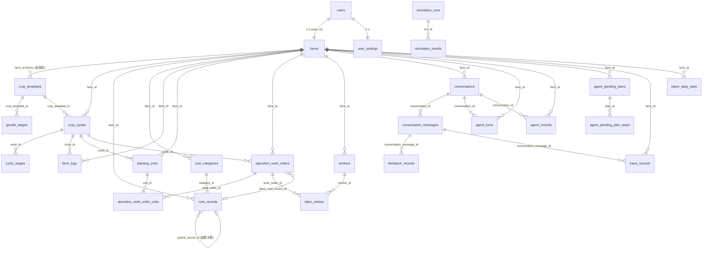

# 10 — 数据库结构设计

> 状态：草稿 | 维护：BlockShip | 关联：[04_相关规范/03_数据库与迁移规范](../04_相关规范/03_数据库与迁移规范.md)、[01_Agent平台架构](./01_Agent平台架构.md)、[03_接口协议/01_HTTP_API协议](../03_接口协议/01_HTTP_API协议.md)

---

## 1. 文档定位

本文档定义 Farm Manager 后端 MySQL 8.x 的**完整表结构设计**。它从接口协议（HTTP API / Agent 内部接口 / 外部服务接口 / Skill 契约）反推实体与字段，落地到具体表。

**与 [04_相关规范/03_数据库与迁移规范](../04_相关规范/03_数据库与迁移规范.md) 的边界**：

| 文档 | 回答的问题 |
| --- | --- |
| 03_数据库与迁移规范 | **怎么改**：命名规则、迁移工具、连接池、回滚原则 |
| 本文档（10_数据库结构设计） | **是什么**：有哪些表、字段、关系、索引，为什么这样设计 |

冲突时以代码 (`backend/app/models/`) 为准；代码改动必须同步本文档。

## 2. 设计原则

| 原则 | 落地方式 |
| --- | --- |
| **多租户隔离** | 所有业务表带 `farm_id` 外键，外层用 `modules/farm/dependencies.current_farm` 注入；跨 `farm_id` 查询在 [03_数据库与迁移规范 § 5.2](../04_相关规范/03_数据库与迁移规范.md) 明确禁止 |
| **金额单位统一** | 金额用 `Numeric(10,2)`（保留两位小数），接口对外暴露「分」整数；详见 § 5.3 |
| **JSON 谨慎使用** | 仅用于半结构化扩展数据（trace payload、tool params、flywheel evidence），详见 [03_数据库与迁移规范 § 2.5](../04_相关规范/03_数据库与迁移规范.md) |
| **软删除按需** | 仅 `cost_records.deleted_at` 等关键业务表启用，普通表硬删 |
| **时区统一** | `DateTime(timezone=True)` + `server_default=func.now()`；北京时间业务时间通过 `app/core/timezone.beijing_now` 注入 |
| **系统模板零农场** | `crop_templates.farm_id IS NULL` 表示系统库；按 `region_tag` 优先匹配，详见 § 6.3 |
| **JSONL 旁路** | trace/event 大体积原始数据走 JSONL 文件，MySQL 只存热索引（详见 [07_可观测与运维 § 3](./07_可观测与运维.md)） |

## 3. 模块划分

按业务域分组，与 [08_业务模块化](./08_业务模块化.md) 一致：

| 子域 | 表数 | 包含 |
| --- | --- | --- |
| **身份与租户** | 3 | `users`、`farms`、`user_settings` |
| **作物与茬口** | 4 | `crop_templates`、`growth_stages`、`crop_cycles`、`cycle_stages` |
| **账务** | 2 | `cost_records`、`cost_categories` |
| **农事与用工** | 6 | `farm_logs`、`planting_units`、`operation_work_orders`、`operation_work_order_units`、`workers`、`labor_entries` |
| **会话与 Agent** | 5 | `conversations`、`conversation_messages`、`agent_turns`、`agent_records`、`agent_pending_plans` + `agent_pending_plan_steps` |
| **数据飞轮** | 4 | `agent_data_flywheel_labels`、`agent_data_flywheel_prelabels`、`agent_case_drafts`、`agent_repair_packs` |
| **仿真评测** | 2 | `simulation_runs`、`simulation_results` |
| **可观测** | 4 | `trace_records`、`token_daily_stats`、`guardrails_logs`、`feedback_records` |
| **基础设施** | 2 | `idempotency_keys`、`alembic_version`（Alembic 自维护） |
| **预留待建** | 3 | `memory_records`、`audit_logs`、`evaluation_reports` |

## 4. 实体关系图

## 5. 身份与租户

### 5.1 `users` — 用户

| 字段 | 类型 | 约束 | 说明 |
| --- | --- | --- | --- |
| `id` | `VARCHAR(36)` | PK | UUID |
| `phone` | `VARCHAR(20)` | UNIQUE, NOT NULL | 手机号，登录主键 |
| `password_hash` | `VARCHAR(128)` | NOT NULL | bcrypt 哈希 |
| `nickname` | `VARCHAR(50)` | DEFAULT '农友' | 昵称 |
| `avatar_url` | `VARCHAR(500)` | NULL | 头像 URL |
| `role` | `VARCHAR(20)` | DEFAULT 'user' | `user` / `admin` |
| `status` | `VARCHAR(20)` | DEFAULT 'active' | `active` / `disabled` |
| `token_monthly_limit` | `INT` | NULL | Token 月预算（用户级覆写） |
| `token_weekly_limit` | `INT` | NULL | Token 周预算 |
| `created_at` | `DATETIME(tz)` | server_default now | — |

**索引**：`phone` UNIQUE。
**关系**：1:1 关联 `farms.user_id` 和 `user_settings.user_id`。

### 5.2 `farms` — 农场（多租户顶层）

| 字段 | 类型 | 约束 | 说明 |
| --- | --- | --- | --- |
| `id` | `INT` | PK, AUTO_INCREMENT | 内部 ID，所有业务表外键 |
| `uid` | `VARCHAR(36)` | UNIQUE, NOT NULL | 对外 UUID（[migration 9c2a1d7b4e6f](../../backend/alembic/versions/) 引入） |
| `name` | `VARCHAR(100)` | NOT NULL | 农场名 |
| `location` | `VARCHAR(200)` | NULL | 农场地理位置 |
| `user_id` | `VARCHAR(36)` | UNIQUE, NULL | 关联 `users.id`（一对一） |
| `created_at` | `DATETIME(tz)` | server_default now | — |

**索引**：`uid` UNIQUE、`user_id` UNIQUE。
**说明**：当前阶段 1 用户 1 农场；`uid` 用于对外暴露（不暴露内部自增 ID）。

### 5.3 `user_settings` — 用户设置

| 字段 | 类型 | 约束 | 说明 |
| --- | --- | --- | --- |
| `id` | `INT` | PK | — |
| `user_id` | `VARCHAR(36)` | FK→users, UNIQUE | 一对一 |
| `default_city` | `VARCHAR(50)` | NULL | 默认城市（拼音小写，如 `xuzhou`，对应 `region_tag`） |
| `default_lat` | `FLOAT` | NULL | 默认纬度 |
| `default_lon` | `FLOAT` | NULL | 默认经度 |
| `assistant_role` | `VARCHAR(20)` | DEFAULT 'warm' | 人设：`professional` / `warm` / `creative` |
| `created_at` / `updated_at` | `DATETIME(tz)` | — | — |

**索引**：`user_id` UNIQUE。
**关联接口**：`GET/PUT /api/v1/settings`。

## 6. 作物与茬口

### 6.1 `crop_templates` — 作物模板

| 字段 | 类型 | 约束 | 说明 |
| --- | --- | --- | --- |
| `id` | `INT` | PK | — |
| `farm_id` | `INT` | FK→farms, NULL | **NULL 表示系统库**（由迁移 `20260619_crop_template_system_library_base` 改为可空） |
| `name` | `VARCHAR(100)` | NOT NULL | 作物名 |
| `variety` | `VARCHAR(100)` | NULL | 品种 |
| `category` | `VARCHAR(50)` | NULL | 分类（蔬菜/水果/粮食等，迁移 `20260619_crop_template_category_and_dedup_index` 引入） |
| `region_tag` | `VARCHAR(40)` | **待加** | 地域标签（`default` / `xuzhou` / ...），系统模板专用，详见 [openspec/changes/extend-crop-template-with-region-tag](../../openspec/changes/extend-crop-template-with-region-tag/proposal.md) |
| `dedup_key` | `VARCHAR(40)` | **待加** | 去重键（name+variety+region 哈希） |
| `created_at` | `DATETIME(tz)` | — | — |

**索引**：复合 `ix_crop_templates_farm_name_variety (farm_id, name, variety)`；`region_tag`、`dedup_key` 待加。
**地域化策略**：`region` 参数从 `UserSettings.default_city` 映射，`GET /api/v1/crops/templates/system?region=` 按城市优先匹配，fallback 到 `default`。当前生产版本仅有 `farm_id IS NULL` 系统库基础，`region_tag` 维度待 openspec 提案落地。

### 6.2 `growth_stages` — 生长阶段（模板级）

| 字段 | 类型 | 约束 | 说明 |
| --- | --- | --- | --- |
| `id` | `INT` | PK | — |
| `crop_template_id` | `INT` | FK→crop_templates | 所属模板 |
| `name` | `VARCHAR(100)` | NOT NULL | 阶段名（苗期/花期/膨果期/...） |
| `duration_days` | `INT` | NOT NULL | 持续天数 |
| `order_index` | `INT` | NOT NULL | 阶段顺序 |
| `key_tasks` | `VARCHAR(500)` | NULL | 关键农事提示 |

**关系**：模板 → 多个阶段（cascade delete）。

### 6.3 `crop_cycles` — 茬口

| 字段 | 类型 | 约束 | 说明 |
| --- | --- | --- | --- |
| `id` | `INT` | PK | — |
| `farm_id` | `INT` | FK→farms | — |
| `name` | `VARCHAR(100)` | NOT NULL | 茬口名（如「春番茄 1 号棚」） |
| `crop_template_id` | `INT` | FK→crop_templates, RESTRICT | 模板（不可直接删除被引用的模板） |
| `start_date` | `DATE` | NOT NULL | 起始日期 |
| `field_name` | `VARCHAR(100)` | NULL | 田块名（兼容字段，新数据走 `planting_units`） |
| `total_area_mu` | `NUMERIC(10,2)` | NULL | 总面积（亩） |
| `season` | `VARCHAR(50)` | NULL | 季节（春/夏/秋/冬） |
| `batch_note` | `VARCHAR(500)` | NULL | 备注 |
| `status` | `VARCHAR(20)` | DEFAULT 'active' | `active` / `archived` / `ended` |
| `created_at` | `DATETIME(tz)` | — | — |

**关系**：1 个茬口 → 多 `cycle_stages` / `farm_logs` / `planting_units` / `operation_work_orders`。
**关联接口**：`GET/POST /api/v1/cycles`、`DELETE /api/v1/cycles/{id}`。

### 6.4 `cycle_stages` — 茬口阶段（实例级）

| 字段 | 类型 | 约束 | 说明 |
| --- | --- | --- | --- |
| `id` | `INT` | PK | — |
| `cycle_id` | `INT` | FK→crop_cycles | — |
| `name` | `VARCHAR(100)` | NOT NULL | 阶段名 |
| `start_date` / `end_date` | `DATE` | NOT NULL | 实际起止 |
| `order_index` | `INT` | NOT NULL | 顺序 |
| `duration_days` | `INT` | NOT NULL | 天数 |
| `key_tasks` | `VARCHAR(500)` | NULL | 关键任务 |
| `is_current` | `BOOL` | DEFAULT FALSE | 是否当前阶段（业务保证同时仅一条 TRUE） |

## 7. 账务

### 7.1 `cost_categories` — 账务分类

| 字段 | 类型 | 约束 | 说明 |
| --- | --- | --- | --- |
| `id` | `INT` | PK | — |
| `farm_id` | `INT` | FK→farms | 农场隔离 |
| `name` | `VARCHAR(50)` | NOT NULL | 分类名（化肥/农药/番茄收入/...） |
| `type` | `VARCHAR(10)` | NOT NULL | `cost` / `income` |
| `icon` | `VARCHAR(50)` | DEFAULT 'tag' | 图标 key |
| `sort_order` | `INT` | DEFAULT 0 | 排序 |
| `is_default` | `BOOL` | DEFAULT FALSE | 是否默认分类（系统初始化） |
| `created_at` | `DATETIME(tz)` | — | — |

**关联接口**：`GET/POST /api/v1/costs/categories`。

### 7.2 `cost_records` — 账务记录（成本/收入/赊账/工资派生）

| 字段 | 类型 | 约束 | 说明 |
| --- | --- | --- | --- |
| `id` | `INT` | PK | — |
| `farm_id` | `INT` | FK→farms | — |
| `cycle_id` | `INT` | FK→crop_cycles, NULL | 关联茬口（可选） |
| `record_type` | `VARCHAR(20)` | NOT NULL | `cost` / `income` |
| `category` | `VARCHAR(50)` | NOT NULL | 分类名（冗余快照） |
| `category_id` | `INT` | FK→cost_categories, NULL | 分类外键 |
| `category_name_snapshot` | `VARCHAR(50)` | NULL | 写入时分类名快照（防分类改名） |
| `amount` | `NUMERIC(10,2)` | NOT NULL | 金额（元，对外暴露时 ×100 转分） |
| `settled_amount` | `NUMERIC(10,2)` | DEFAULT 0 | 已结算金额（赊账场景） |
| `settlement_status` | `VARCHAR(20)` | DEFAULT 'settled' | `settled` / `partial` / `unsettled`（由 `_sync_settlement_fields` 事件派生） |
| `record_date` | `DATE` | NOT NULL | 业务日期 |
| `recorded_at` | `DATETIME(tz)` | NULL | 业务时刻（北京时间，`before_insert`/`before_update` 事件规范化） |
| `note` | `VARCHAR(500)` | NULL | 备注 |
| `record_subtype` | `VARCHAR(50)` | NULL | 子类型（`赊账` / `现金` / `转账`/...） |
| `counterparty` | `VARCHAR(100)` | NULL | 交易对手（赊账场景的店家/工人） |
| `due_date` | `DATE` | NULL | 应付到期日（赊账） |
| `settled_at` | `DATETIME(tz)` | NULL | 实际结算时间 |
| `parent_record_id` | `INT` | FK→cost_records, NULL | 父记录（赊账→还款关联） |
| `source_type` | `VARCHAR(50)` | NULL | 来源类型（`operation_work_order` / `labor_entry` / `agent` / `manual`） |
| `source_id` | `INT` | NULL | 来源记录 ID |
| `source_active_key` | `VARCHAR(20)` | NULL | 活动来源标记（`active` / NULL，由事件维护） |
| `deleted_at` | `DATETIME(tz)` | NULL | 软删除时间 |
| `created_at` | `DATETIME(tz)` | server_default now | — |

**唯一约束**：`uq_cost_records_active_source (farm_id, source_type, source_id, source_active_key)` — 防止同来源重复入账。
**事件钩子**：`_set_default_recorded_at` / `_normalize_recorded_at` / `_sync_source_active_key` / `_sync_settlement_fields` 在 insert/update 前派生字段。
**关联接口**：`GET/POST/PUT/DELETE /api/v1/costs`、`GET /api/v1/costs/summary`、`GET /api/v1/costs/analytics`、`GET /api/v1/debts`（filter `record_subtype='赊账' AND settlement_status<>'settled'`）。

## 8. 农事与用工

### 8.1 `farm_logs` — 农事日志

| 字段 | 类型 | 约束 | 说明 |
| --- | --- | --- | --- |
| `id` | `INT` | PK | — |
| `farm_id` | `INT` | FK→farms | — |
| `cycle_id` | `INT` | FK→crop_cycles, CASCADE | 关联茬口 |
| `operation_type` | `VARCHAR(50)` | NOT NULL | 操作类型（浇水/打药/施肥/采收/...） |
| `operation_date` | `DATE` | NOT NULL | 操作日期 |
| `operation_time` | `DATETIME` | NULL | 操作时刻 |
| `note` | `VARCHAR(500)` | NULL | 备注 |
| `photo_urls` | `VARCHAR(2000)` | NULL | 照片 URL（JSON 字符串） |
| `created_at` | `DATETIME(tz)` | — | — |

**关联接口**：`GET/POST /api/v1/logs`。

### 8.2 `planting_units` — 地块/种植单元

| 字段 | 类型 | 约束 | 说明 |
| --- | --- | --- | --- |
| `id` | `INT` | PK | — |
| `farm_id` | `INT` | FK→farms | — |
| `cycle_id` | `INT` | FK→crop_cycles, CASCADE | 所属茬口 |
| `name` | `VARCHAR(100)` | NOT NULL | 单元名（1 号棚/东地块） |
| `area_mu` | `NUMERIC(10,2)` | NULL | 面积（亩） |
| `planted_date` | `DATE` | NULL | 定植日期 |
| `status` | `VARCHAR(20)` | DEFAULT 'active' | `active` / `harvested` / `abandoned` |
| `note` | `VARCHAR(500)` | NULL | 备注 |
| `created_at` / `updated_at` | `DATETIME(tz)` | — | — |

**关联接口**：`GET/POST /api/v1/planting-units`。

### 8.3 `operation_work_orders` — 农事工单

| 字段 | 类型 | 约束 | 说明 |
| --- | --- | --- | --- |
| `id` | `INT` | PK | — |
| `farm_id` | `INT` | FK→farms | — |
| `cycle_id` | `INT` | FK→crop_cycles, NULL | 关联茬口（农场级作业可空） |
| `operation_type` | `VARCHAR(50)` | NOT NULL | 作业类型 |
| `operation_date` | `DATE` | NOT NULL, INDEX | 作业日期 |
| `scope_type` | `VARCHAR(20)` | DEFAULT 'cycle' | `cycle` / `unit` / `farm` |
| `note` | `VARCHAR(500)` | NULL | 备注 |
| `photo_urls` | `TEXT` | NULL | 照片 URL JSON |
| `source_type` | `VARCHAR(50)` | NULL | 来源类型 |
| `source_id` | `INT` | NULL | 来源 ID |
| `labor_cost_record_id` | `INT` | FK→cost_records, NULL | 工资成本账单回链 |
| `created_at` / `updated_at` | `DATETIME(tz)` | — | — |

**关联接口**：`GET/POST /api/v1/operations`。

### 8.4 `operation_work_order_units` — 工单-单元关联表

| 字段 | 类型 | 约束 | 说明 |
| --- | --- | --- | --- |
| `id` | `INT` | PK | — |
| `work_order_id` | `INT` | FK→operation_work_orders, CASCADE | — |
| `unit_id` | `INT` | FK→planting_units, CASCADE | — |

**唯一约束**：`uq_operation_work_order_units_order_unit (work_order_id, unit_id)`。
**用途**：`scope_type='unit'` 时记录作业作用的具体地块（M:N）。

### 8.5 `workers` — 工人

| 字段 | 类型 | 约束 | 说明 |
| --- | --- | --- | --- |
| `id` | `INT` | PK | — |
| `farm_id` | `INT` | FK→farms | — |
| `name` | `VARCHAR(100)` | NOT NULL | 工人姓名 |
| `phone` | `VARCHAR(30)` | NULL | 联系方式 |
| `default_pay_type` | `VARCHAR(20)` | DEFAULT 'daily' | 默认计酬方式（`daily` / `hourly` / `piece`） |
| `default_unit_price` | `NUMERIC(10,2)` | NULL | 默认单价 |
| `note` | `VARCHAR(500)` | NULL | 备注 |
| `status` | `VARCHAR(20)` | DEFAULT 'active' | `active` / `disabled`（禁用后不能被新工单引用） |
| `created_at` / `updated_at` | `DATETIME(tz)` | — | — |

**关联接口**：`GET /api/v1/workers`。

### 8.6 `labor_entries` — 用工明细/工资

| 字段 | 类型 | 约束 | 说明 |
| --- | --- | --- | --- |
| `id` | `INT` | PK | — |
| `farm_id` | `INT` | FK→farms | — |
| `work_order_id` | `INT` | FK→operation_work_orders, CASCADE | 所属工单 |
| `worker_id` | `INT` | FK→workers | 工人 |
| `pay_type` | `VARCHAR(20)` | DEFAULT 'daily' | 计酬方式 |
| `quantity` | `NUMERIC(10,2)` | DEFAULT 1 | 数量（天/小时/件） |
| `unit_price` | `NUMERIC(10,2)` | NOT NULL | 单价 |
| `payable_amount` | `NUMERIC(10,2)` | NOT NULL | 应付金额 |
| `paid_amount` | `NUMERIC(10,2)` | DEFAULT 0 | 已付金额 |
| `unpaid_amount` | `NUMERIC(10,2)` | DEFAULT 0 | 未付金额 |
| `settlement_status` | `VARCHAR(20)` | DEFAULT 'unpaid' | `unpaid` / `partial` / `paid` |
| `client_request_id` | `VARCHAR(100)` | NULL | 客户端幂等 ID |
| `note` | `VARCHAR(500)` | NULL | 备注 |
| `created_at` / `updated_at` | `DATETIME(tz)` | — | — |

**唯一约束**：`uq_labor_entries_farm_client_request (farm_id, client_request_id)`。
**关联接口**：`GET /api/v1/labor/payables`。

## 9. 会话与 Agent

### 9.1 `conversations` — 会话

| 字段 | 类型 | 约束 | 说明 |
| --- | --- | --- | --- |
| `id` | `INT` | PK | — |
| `farm_id` | `INT` | FK→farms, INDEX | — |
| `user_id` | `VARCHAR(36)` | NULL | 发起用户 |
| `session_id` | `VARCHAR(64)` | UNIQUE, NOT NULL, INDEX | 对外会话 ID |
| `status` | `VARCHAR(20)` | DEFAULT 'active' | `active` / `closed` |
| `summary` | `TEXT` | NULL | 会话摘要（[04_Memory工程 § 12](./04_Memory工程.md) 落地字段） |
| `summary_updated_at` | `DATETIME(tz)` | NULL | 摘要最后更新 |
| `last_turn_id` | `INT` | NULL | 最后轮次 ID |
| `last_event_seq` | `INT` | NULL | JSONL 事件序列号 |
| `meta_json` | `JSON` | NULL | 扩展元数据 |
| `created_at` / `last_active_at` | `DATETIME(tz)` | — | `last_active_at` ON UPDATE now |

**说明**：每个 `farm_id` 同时只有一个 `active` 会话；关闭会话后可发起新会话。
**关联接口**：`GET /api/v1/agent/history`、`GET /api/v1/agent/sessions/{id}`。

### 9.2 `conversation_messages` — 会话消息

| 字段 | 类型 | 约束 | 说明 |
| --- | --- | --- | --- |
| `id` | `INT` | PK | — |
| `conversation_id` | `INT` | FK→conversations, CASCADE | — |
| `role` | `VARCHAR(20)` | NOT NULL | `user` / `assistant` / `tool` / `system` |
| `content` | `TEXT` | NOT NULL | 消息正文 |
| `meta` | `TEXT` | NULL | 元信息（JSON 字符串，旧字段） |
| `turn_id` | `INT` | NULL, INDEX | 轮次 ID |
| `content_hash` | `VARCHAR(64)` | NULL | 内容哈希（去重） |
| `meta_json` | `JSON` | NULL | 元信息（新字段） |
| `created_at` | `DATETIME(tz)` | — | — |

**索引**：`turn_id`、`conversation_id`（FK 自带）。
**关联接口**：被 `agent_turns`、`trace_records`、`feedback_records` 反向外键引用。

### 9.3 `agent_turns` — 单轮聚合

| 字段 | 类型 | 约束 | 说明 |
| --- | --- | --- | --- |
| `id` | `INT` | PK | — |
| `farm_id` | `INT` | FK→farms, INDEX | — |
| `session_id` | `VARCHAR(64)` | NOT NULL, INDEX | — |
| `conversation_id` | `INT` | FK→conversations, CASCADE, INDEX | — |
| `request_id` | `VARCHAR(16)` | NOT NULL, INDEX | HTTP 请求 ID |
| `user_message_id` | `INT` | FK→conversation_messages, SET NULL | 用户消息回链 |
| `assistant_message_id` | `INT` | FK→conversation_messages, SET NULL | 助手消息回链 |
| `input_preview` / `reply_preview` | `TEXT` | NULL | 预览文本 |
| `intent_count` / `selected_tools_count` / `tool_calls_count` / `token_total` / `latency_ms` | `INT` | NULL | 链路统计 |
| `status` | `VARCHAR(20)` | DEFAULT 'success' | `success` / `failed` / `timeout` |
| `pending_plan_id` | `VARCHAR(64)` | NULL, INDEX | 关联 pending plan |
| `event_file` | `TEXT` | NULL | JSONL 事件文件路径 |
| `event_seq_start` / `event_seq_end` | `INT` | NULL | JSONL 事件起止序号 |
| `event_write_status` | `VARCHAR(20)` | DEFAULT 'not_started' | `not_started` / `writing` / `done` / `failed` |
| `risk_score` | `FLOAT` | NULL（**P2 待加**） | Discovery Layer 风险评分，详见 [06_数据飞轮 § 9.6](./06_数据飞轮与评测.md) |
| `created_at` | `DATETIME` | INDEX | — |

**用途**：DataFlywheel 列表页主查询表，避免扫 JSONL。
**P2 待加字段**：`risk_score`、`dominant_signal`、`rule_hits_json`、`judge_bad_prob`、`judge_issue_type`（Discovery Layer 落地时一并迁移）。

### 9.4 `agent_records` — Agent 输出统一记录

| 字段 | 类型 | 约束 | 说明 |
| --- | --- | --- | --- |
| `id` | `INT` | PK | — |
| `farm_id` | `INT` | FK→farms | — |
| `user_id` | `VARCHAR(36)` | NULL | 触发用户 |
| `conversation_id` | `INT` | FK→conversations, NULL | 关联会话（chat 类型） |
| `cycle_id` | `INT` | FK→crop_cycles, SET NULL | 关联茬口（建议类） |
| `record_type` | `VARCHAR(20)` | NOT NULL | `chat` / `daily` / `report` |
| `content` | `TEXT` | NOT NULL | 输出正文 |
| `meta` | `TEXT` | NULL | 元信息 JSON（token_usage、latency_ms 等） |
| `created_at` | `DATETIME(tz)` | — | — |

**说明**：合并了原 `advice_records` 和 `report_records`，对应 `daily_advice_use_case` 和 `report_use_case` 的输出落盘。

### 9.5 `agent_pending_plans` + `agent_pending_plan_steps` — 待确认计划

`agent_pending_plans`（生产 SQL 中字段多为 NOT NULL 无默认值，写入时必须显式提供）：

| 字段 | 类型 | 约束 | 说明 |
| --- | --- | --- | --- |
| `id` | `INT` | PK | — |
| `plan_id` | `VARCHAR(64)` | UNIQUE, INDEX | 对外 plan ID |
| `farm_id` | `INT` | FK→farms, INDEX | — |
| `session_id` | `VARCHAR(64)` | NULL, INDEX | 关联会话 |
| `status` | `VARCHAR(32)` | NOT NULL, INDEX | `pending` / `confirmed` / `cancelled` / `expired` / `executed` |
| `current_step_index` | `INT` | NOT NULL | 多步执行游标（应用层默认 0） |
| `raw_user_input` | `TEXT` | NOT NULL | 原始用户输入 |
| `router_decision` | `JSON` | NOT NULL | 路由决策证据 |
| `router_decision_json` | `JSON` | NULL | 路由决策 JSON 备份（兼容字段） |
| `expires_at` | `DATETIME` | NULL, INDEX | 过期时间（默认 5 分钟，应用层填充） |
| `created_at` / `updated_at` | `DATETIME` | DEFAULT now | — |

`agent_pending_plan_steps`（生产 SQL 中 `plan_id` 走 CASCADE 外键到 `agent_pending_plans.plan_id`）：

| 字段 | 类型 | 约束 | 说明 |
| --- | --- | --- | --- |
| `id` | `INT` | PK | — |
| `plan_id` | `VARCHAR(64)` | NOT NULL, INDEX, FK CASCADE | 字符串外键到 `agent_pending_plans.plan_id` |
| `step_id` | `VARCHAR(64)` | NOT NULL | 步骤 ID |
| `step_index` | `INT` | NOT NULL | 步骤顺序 |
| `tool_name` | `VARCHAR(100)` | NOT NULL | LangChain tool_call 名 |
| `skill_name` | `VARCHAR(100)` | NULL, INDEX | Skill 名（生产可空，应用层兜底） |
| `params` | `JSON` | NOT NULL | 调用参数 |
| `params_json` | `JSON` | NULL | 兼容字段 |
| `depends_on` | `JSON` | NOT NULL | 前置步骤（空数组也必须显式传入） |
| `confirmation_state` | `VARCHAR(32)` | NOT NULL | `pending` / `confirmed` / `cancelled` |
| `execution_status` | `VARCHAR(32)` | NOT NULL | `pending` / `running` / `executed` / `failed` |
| `status` | `VARCHAR(20)` | DEFAULT 'pending', INDEX | 步骤聚合状态 |
| `requires_confirmation` | `BOOL` | DEFAULT TRUE | 是否需要二次确认 |
| `confirmation_text` | `TEXT` | NULL | 确认话术 |
| `result_payload` / `result_json` | `JSON` | NULL | 执行结果 |
| `error_payload` / `error_message` | — | NULL | 执行错误 |
| `created_at` / `updated_at` | `DATETIME` | DEFAULT now | — |

**关联接口**：`POST /api/v1/pending/{id}/confirm`、`POST /api/v1/pending/{id}/cancel`。
**说明**：Pending Action 是写操作 Skill 的二次确认载体，详见 [03_接口协议/04_Skill接口契约 § 3](../03_接口协议/04_Skill接口契约.md)。

## 10. 数据飞轮

### 10.1 `agent_data_flywheel_labels` — 人工标注

| 字段 | 类型 | 约束 | 说明 |
| --- | --- | --- | --- |
| `id` | `INT` | PK | — |
| `farm_id` | `INT` | FK→farms, INDEX | — |
| `sample_id` | `VARCHAR(160)` | NOT NULL, INDEX | 样本 ID（如 `turn:<agent_turns.id>`） |
| `sample_type` | `VARCHAR(40)` | NOT NULL, INDEX | `turn` / `session` / `simulation` |
| `session_id` / `turn_id` / `request_id` | — | INDEX | 链路回溯三元组 |
| `label` | `VARCHAR(64)` | NOT NULL, INDEX | § 6 标签体系（如 `bad_reply`、`hallucinated_execution`） |
| `status` | `VARCHAR(20)` | DEFAULT 'open', INDEX | `open` / `resolved` / `dismissed` |
| `comment` | `TEXT` | NULL | 标注备注 |
| `annotator_id` | `VARCHAR(64)` | NULL, INDEX | 标注员 |
| `created_at` / `updated_at` | `DATETIME` | INDEX | — |

### 10.2 `agent_data_flywheel_prelabels` — LLM 预标注

| 字段 | 类型 | 约束 | 说明 |
| --- | --- | --- | --- |
| `id` | `INT` | PK | — |
| `farm_id` | `INT` | FK→farms, INDEX | — |
| `sample_id` / `sample_type` / `session_id` / `turn_id` / `request_id` | — | INDEX | 同 § 10.1 |
| `source` | `VARCHAR(32)` | DEFAULT 'llm_judge', INDEX | `rule` / `llm_judge` |
| `status` | `VARCHAR(20)` | DEFAULT 'pending', INDEX | `pending` / `accepted` / `rejected` |
| `labels` | `JSON` | NOT NULL | 候选标签数组 |
| `root_cause` | `TEXT` | NULL | 根因 |
| `severity` | `VARCHAR(20)` | NOT NULL, INDEX | `P0` / `P1` / `P2` |
| `confidence` | `FLOAT` | DEFAULT 0 | 置信度 0-1 |
| `reason` | `TEXT` | NOT NULL | 判定理由 |
| `recommended_fix` | `TEXT` | NULL | 修复建议 |
| `judge_model` | `VARCHAR(80)` | NOT NULL, INDEX | Judge 模型（如 `claude-haiku-4-5`） |
| `prompt_version` | `VARCHAR(80)` | NOT NULL, INDEX | Judge prompt 版本 |
| `raw_response` / `accepted_label_ids` | `JSON` | NULL | 原始响应、采纳的标签 |
| `reviewed_by` / `reviewed_at` | — | INDEX | 人工复核 |
| `created_at` / `updated_at` | `DATETIME` | INDEX | — |

**关键约束**：Judge 结果**不可作为最终真值**，最终真值在 `agent_data_flywheel_labels`（详见 [06_数据飞轮 § 5](./06_数据飞轮与评测.md)）。

### 10.3 `agent_case_drafts` — 评测用例草稿

| 字段 | 类型 | 约束 | 说明 |
| --- | --- | --- | --- |
| `id` | `INT` | PK | — |
| `farm_id` | `INT` | FK→farms, INDEX | — |
| `draft_id` | `VARCHAR(64)` | UNIQUE, INDEX | 对外 draft ID |
| `source_sample_id` | `VARCHAR(160)` | NOT NULL, INDEX | 来源样本 |
| `target_type` | `VARCHAR(32)` | NOT NULL, INDEX | `regression` / `evaluation` / `sft` |
| `status` | `VARCHAR(20)` | DEFAULT 'draft', INDEX | `draft` / `promoted` / `archived` |
| `case_json` | `JSON` | NOT NULL | case body（含 expected skills、expected pending、reply assertions、expected db diff） |
| `created_by` | `VARCHAR(64)` | NULL, INDEX | 创建人 |
| `created_at` / `updated_at` | `DATETIME` | INDEX | — |

### 10.4 `agent_repair_packs` — 修复包

| 字段 | 类型 | 约束 | 说明 |
| --- | --- | --- | --- |
| `id` | `INT` | PK | — |
| `farm_id` | `INT` | FK→farms, INDEX | — |
| `pack_id` | `VARCHAR(80)` | UNIQUE, INDEX | 对外 pack ID |
| `fix_target` | `VARCHAR(40)` | NOT NULL, INDEX | `prompt` / `router` / `skill` / `pending_plan` |
| `labels` | `JSON` | NOT NULL | 关联标签 |
| `source_sample_ids` | `JSON` | NOT NULL | 关联样本 |
| `source_label_ids` | `JSON` | NOT NULL | 关联标注 |
| `dedup_key` | `VARCHAR(40)` | **待加**（迁移 `20260620_agent_repair_packs_dedup_key` 已写，待应用到生产） | 去重键 |
| `status` | `VARCHAR(20)` | DEFAULT 'draft', INDEX | `draft` / `applied` / `verified` / `wontfix` |
| `export_path` | `TEXT` | NULL | 导出文件路径 |
| `manifest_json` | `JSON` | NULL | 清单 |
| `export_error` / `repair_note` / `verification_summary` | — | NULL | 错误/说明/验证摘要 |
| `created_by` / `resolved_by` / `resolved_at` | — | INDEX | 责任人 |
| `created_at` / `updated_at` | `DATETIME` | INDEX | — |

**关联文档**：[docs/architecture/data-flywheel-repair-pack-workflow.md](../../docs/architecture/data-flywheel-repair-pack-workflow.md)。

## 11. 仿真评测

### 11.1 `simulation_runs` — 仿真运行

| 字段 | 类型 | 约束 | 说明 |
| --- | --- | --- | --- |
| `id` | `INT` | PK | — |
| `run_id` | `VARCHAR(32)` | UNIQUE, INDEX | 对外 run ID |
| `farm_id` | `INT` | FK→farms, DEFAULT 1 | — |
| `status` | `VARCHAR(16)` | DEFAULT 'running' | `running` / `passed` / `failed` / `error` |
| `total` / `passed` / `failed` | `INT` | DEFAULT 0 | 统计 |
| `profile` | `VARCHAR(32)` | NULL | 运行配置名 |
| `error` | `TEXT` | NULL | 错误信息 |
| `created_at` | `DATETIME(tz)` | — | — |

### 11.2 `simulation_results` — 单用例结果

| 字段 | 类型 | 约束 | 说明 |
| --- | --- | --- | --- |
| `id` | `INT` | PK | — |
| `run_id` | `VARCHAR(32)` | NOT NULL, INDEX | FK→runs（字符串） |
| `farm_id` | `INT` | FK→farms, DEFAULT 1 | — |
| `case_id` | `VARCHAR(64)` | NOT NULL | 用例 ID |
| `passed` | `INT` | DEFAULT 0 | 0/1 |
| `agent_reply` | `TEXT` | NULL | Agent 实际回复 |
| `errors_json` | `JSON` | NULL | 错误列表 |
| `db_diff_json` | `JSON` | NULL | 实际 vs 期望 DB 差异 |
| `extracted_claims_json` | `JSON` | NULL | 回复中提取的事实声明 |
| `latency_ms` | `INT` | DEFAULT 0 | 延迟 |
| `category` | `VARCHAR(32)` | NULL | 用例分类 |
| `user_input` | `TEXT` | NULL | 用例输入 |
| `pending_action_json` | `JSON` | NULL | 实际 pending |
| `expected_db_changes_json` | `JSON` | NULL | 期望 DB 变更 |
| `created_at` | `DATETIME(tz)` | — | — |

**关联接口**：`GET /api/v1/admin/simulation/run`。

## 12. 可观测

### 12.1 `trace_records` — Trace 热索引

| 字段 | 类型 | 约束 | 说明 |
| --- | --- | --- | --- |
| `id` | `INT` | PK | — |
| `request_id` | `VARCHAR(16)` | NOT NULL, INDEX | HTTP 请求 ID |
| `session_id` | `VARCHAR(64)` | NULL | 会话 ID |
| `farm_id` | `INT` | FK→farms | — |
| `round_index` | `INT` | DEFAULT 0 | LLM 推理轮次 |
| `node_type` | `VARCHAR(20)` | NOT NULL | `llm_call` / `skill_call` / `prompt_render` |
| `node_name` | `VARCHAR(100)` | NOT NULL | 节点名（如 `agent_node`、`create_cost_record`） |
| `input_data` / `output_data` | `JSON` | NULL | 脱敏后的输入输出摘要 |
| `start_time` / `end_time` | `DATETIME` | NULL | 起止时间 |
| `duration_ms` | `INT` | NULL | 耗时 |
| `token_usage` | `JSON` | NULL | Token 用量 |
| `status` | `VARCHAR(10)` | DEFAULT 'success' | `success` / `error` |
| `error_message` | `TEXT` | NULL | 错误详情 |
| `conversation_message_id` | `INT` | FK→conversation_messages, SET NULL | 关联消息 |
| `created_at` | `DATETIME` | — | — |

**分层**：明细 span 走 JSONL `<repo>/backend/logs/traces/{date}/{trace_id}.jsonl`，详见 [07_可观测与运维 § 3](./07_可观测与运维.md)。
**关联接口**：`GET /api/v1/admin/traces`、`GET /api/v1/admin/traces/{id}`。

### 12.2 `token_daily_stats` — Token 日统计

| 字段 | 类型 | 约束 | 说明 |
| --- | --- | --- | --- |
| `id` | `INT` | PK | — |
| `user_id` | `VARCHAR(36)` | FK→users, NULL, INDEX | 用户 |
| `farm_id` | `INT` | FK→farms, INDEX | — |
| `date` | `DATE` | NOT NULL | 统计日期 |
| `model` | `VARCHAR(100)` | NOT NULL | 模型名 |
| `call_type` | `VARCHAR(20)` | NOT NULL | `chat` / `summary` / `judge` / `embedding` |
| `prompt_tokens` / `completion_tokens` / `total_tokens` / `request_count` | `INT` | DEFAULT 0 | 用量 |
| `estimated_cost_cny` | `NUMERIC(10,6)` | DEFAULT 0 | 估算成本（CNY） |
| `created_at` / `updated_at` | `DATETIME` | — | — |

**唯一约束**：`uq_token_stats (farm_id, date, model, call_type)`。
**关联接口**：`GET /api/v1/admin/tokens/stats`。

### 12.3 `guardrails_logs` — Guardrails 命中

| 字段 | 类型 | 约束 | 说明 |
| --- | --- | --- | --- |
| `id` | `INT` | PK | — |
| `farm_id` | `INT` | NOT NULL | — |
| `trigger_type` | `VARCHAR(50)` | NOT NULL | 命中类型（敏感词/超长/注入/...） |
| `trigger_detail` | `TEXT` | NULL | 详情 |
| `source_text` | `TEXT` | NULL | 源文本（脱敏后） |
| `created_at` | `DATETIME` | — | — |

### 12.4 `feedback_records` — 用户反馈

| 字段 | 类型 | 约束 | 说明 |
| --- | --- | --- | --- |
| `id` | `INT` | PK | — |
| `user_id` | `VARCHAR(36)` | FK→users, INDEX | — |
| `conversation_message_id` | `INT` | FK→conversation_messages, SET NULL | 关联消息 |
| `rating` | `VARCHAR(10)` | NOT NULL | `good` / `bad` |
| `correction` | `TEXT` | NULL | 纠错内容 |
| `created_at` | `DATETIME(tz)` | — | — |

**关联接口**：`POST /api/v1/feedback`。

## 13. 基础设施

### 13.1 `idempotency_keys` — 幂等键

| 字段 | 类型 | 约束 | 说明 |
| --- | --- | --- | --- |
| `key` | `VARCHAR(64)` | PK | 客户端生成的唯一键 |
| `response` | `TEXT` | NOT NULL | 缓存的响应 JSON |
| `created_at` | `DATETIME` | — | — |

**用途**：Smart Fill `POST /api/v1/parse` 防重复解析；`cleanup_old_keys(hours=24)` 定时清理。
**关联接口**：`GET /api/v1/scenarios`、`POST /api/v1/parse`。

### 13.2 `alembic_version` — 迁移版本表

| 字段 | 类型 | 约束 | 说明 |
| --- | --- | --- | --- |
| `version_num` | `VARCHAR(128)` | PK | 当前 alembic revision ID |

**用途**：Alembic 自动维护，禁止手工修改。生产部署后用 `alembic current` 核对，应等于 [backend/alembic/versions/](../../backend/alembic/versions/) 最新 revision。
**当前最新 revision**：`20260620_agent_repair_packs_dedup_key`（生产 dump 2026-06-20 14:16 时 alembic_version 可能滞后于此，部署同步时由 `alembic upgrade head` 补齐）。

## 14. 生产 dump 与代码层差异对账

对照 `backend/sql/farm_manager.sql`（生产 dump 2026-06-20 14:16）与代码层（`backend/app/models/` + `backend/alembic/versions/`），需注意：

| 项 | 生产 dump 状态 | 代码层状态 | 处置 |
| --- | --- | --- | --- |
| `crop_templates.region_tag` | **缺** | model 未定义、迁移未写 | 待 [openspec/changes/extend-crop-template-with-region-tag](../../openspec/changes/extend-crop-template-with-region-tag/proposal.md) 落地 |
| `crop_templates.dedup_key` | **缺** | model 未定义 | 同上 |
| `agent_repair_packs.dedup_key` | **缺** | model 已加，迁移 `20260620_agent_repair_packs_dedup_key` 已写 | 部署同步时 `alembic upgrade head` 补齐 |
| `agent_turns.risk_score` 及 Discovery Layer 字段 | **缺** | model 未定义 | 待 P2 Discovery Layer 落地（详见 [06_数据飞轮 § 9.6](./06_数据飞轮与评测.md)） |
| `agent_pending_plan_steps.skill_name` | DEFAULT NULL | model `NOT NULL` | 生产允许 NULL，应用层兜底，未来 schema hardening 收紧 |
| `feedback_records.user_id` | FK→users, ON DELETE RESTRICT | model 同 | ✓ 一致 |
| `cost_records.settlement_status` | DEFAULT 'settled' | model 同（事件钩子派生） | ✓ 一致 |
| 冗余主键索引（`ix_<table>_id`） | 存在 | — | 后续 schema hardening 清理 |

**对账流程**：每次发布前，开发环境跑 `alembic upgrade head` → 与生产 dump 比对字段差异 → 在本节登记。

## 15. 预留待建表

| 表 | 用途 | 触发时机 | 设计来源 |
| --- | --- | --- | --- |
| `memory_records` | 长时记忆（preference/habit/alias/event/fact） | [04_Memory工程 § 7.2](./04_Memory工程.md) 落地时 | brainstorming 2026-06-19 |
| `audit_logs` | 审计日志（admin 操作） | Admin 模块迁移 | [03_数据库与迁移规范 § 6](../04_相关规范/03_数据库与迁移规范.md) |
| `evaluation_reports` | 评测汇总报告 | Evaluation 模块 P3 | [06_数据飞轮 § 8 P3](./06_数据飞轮与评测.md) |
| `prompt_snapshots` | Prompt 版本快照 | Prompt replay 落地 | [05_Prompt工程](./05_Prompt工程.md) |
| `skill_call_stats` | Skill 调用聚合 | Admin dashboard 增强 | [07_可观测与运维 § 6.3](./07_可观测与运维.md) |

`memory_records` 字段草案（来自 [04_Memory工程 § 7.2](./04_Memory工程.md)）：

| 字段 | 类型 | 说明 |
| --- | --- | --- |
| `id` | `INT` PK | — |
| `farm_id` | `INT` FK→farms, INDEX | — |
| `user_id` | `VARCHAR(36)` FK→users | — |
| `type` | `VARCHAR(20)` | `preference`/`habit`/`alias`/`event`/`fact` |
| `content` | `TEXT` | 自然语言内容 |
| `importance` | `FLOAT` | 0.0-1.0 |
| `status` | `VARCHAR(20)` | `candidate`/`confirmed`/`superseded`/`archived` |
| `confidence` | `FLOAT` | LLM 抽取置信度 |
| `source` | `VARCHAR(20)` | `user_explicit`/`llm_extracted` |
| `superseded_by_id` | `INT` FK→memory_records | 软覆盖指针 |
| `created_at`/`confirmed_at`/`last_referenced_at` | `DATETIME` | — |

## 16. 接口→表映射矩阵

按 [03_接口协议/01_HTTP_API协议 § 5](../03_接口协议/01_HTTP_API协议.md) 端点反推：

| HTTP 端点 | 主操作表 | 只读关联 |
| --- | --- | --- |
| `POST /auth/login` / `refresh` | `users`（校验） | — |
| `GET /auth/me` | `users`, `user_settings`, `farms` | — |
| `POST /agent/chat` / `chat/stream` | `conversations`, `conversation_messages`, `agent_turns`, `agent_records`, `agent_pending_plans`+`steps`, `trace_records`, `token_daily_stats` | 各业务表（通过 Skill） |
| `POST /agent/advice` | `agent_records`（record_type=daily） | `crop_cycles`, `cost_records`, `farm_logs` |
| `GET /agent/history` / `sessions/{id}` | — | `conversations`, `conversation_messages` |
| `POST /pending/{id}/confirm` / `cancel` | `agent_pending_plans`, `agent_pending_plan_steps` | 各业务表（通过 Skill 执行） |
| `GET/POST /scenarios` / `parse` | `idempotency_keys` | Smart Fill 编排各业务表 |
| `GET/POST/PUT/DELETE /costs` | `cost_records`, `cost_categories` | `crop_cycles` |
| `GET /costs/summary` / `analytics` | — | `cost_records`, `cost_categories` |
| `GET /debts` | — | `cost_records`（subtype=赊账） |
| `GET/POST /crops/templates` | `crop_templates`, `growth_stages` | — |
| `GET /crops/templates/system` | — | `crop_templates`（farm_id IS NULL） |
| `POST /crops/templates/system/{id}/import` | `crop_templates`（副本） | — |
| `GET/POST /cycles` | `crop_cycles`, `cycle_stages` | `crop_templates` |
| `DELETE /cycles/{id}` | `crop_cycles` | — |
| `GET/POST /planting-units` | `planting_units` | `crop_cycles` |
| `GET/POST /logs` | `farm_logs` | `crop_cycles` |
| `GET/POST /operations` | `operation_work_orders`, `operation_work_order_units`, `labor_entries` | `planting_units`, `workers` |
| `GET /workers` | — | `workers` |
| `GET /labor/payables` | — | `labor_entries`, `workers` |
| `GET /weather/*` | — | 外部 QWeather/Open-Meteo，无落盘 |
| `GET/PUT /settings` | `user_settings` | — |
| `POST /feedback` | `feedback_records` | — |
| `GET /admin/users` | — | `users` |
| `GET /admin/skills` | — | SkillRegistry（运行时扫描 `skills/*/skill.md`，不入库） |
| `GET /admin/traces` / `{id}` | — | `trace_records` + JSONL 明细 |
| `GET /admin/data-flywheel/samples` | — | `agent_turns` LEFT JOIN `agent_data_flywheel_labels`/`prelabels` |
| `POST /admin/data-flywheel/samples/{id}/label` | `agent_data_flywheel_labels` | — |
| `GET /admin/simulation/run` | `simulation_runs`, `simulation_results` | `agent_case_drafts`（用例源） |
| `GET /admin/evaluation/report` | — | 聚合 `simulation_results`（`evaluation_reports` 待建） |
| `GET /admin/tokens/stats` | — | `token_daily_stats` |

**Agent 内部接口（Python Protocol）→ 表映射**（来自 [02_Agent内部接口](../03_接口协议/02_Agent内部接口.md)）：

| 接口 | 写入表 |
| --- | --- |
| `ConversationService.save_user_message` / `save_assistant_message` | `conversation_messages` |
| `PendingManager.create` / `confirm` / `cancel` / `expire_outdated` | `agent_pending_plans`, `agent_pending_plan_steps` |
| `Reflector.check`（写 trace_payload） | `trace_records`（reflect span） |
| `MemoryService.observe` | `conversation_messages`（短期） + JSONL event（长期走 § 7.2 后 `memory_records`） |
| `MemoryService.consolidate` | `conversations.summary` + `memory_records`（待建） |
| `TraceCollector.emit` | `trace_records` + JSONL `logs/traces/{date}/{trace_id}.jsonl` |

## 17. 索引策略汇总

按 [03_数据库与迁移规范 § 2.4](../04_相关规范/03_数据库与迁移规范.md) 的索引规范，关键复合索引（**来源：生产 dump `backend/sql/farm_manager.sql`**）：

| 索引 | 表 | 字段 | 用途 |
| --- | --- | --- | --- |
| `ix_crop_templates_farm_name_variety` | `crop_templates` | `(farm_id, name, variety)` | 模板去重查询 |
| `ix_cost_records_farm_date_deleted` | `cost_records` | `(farm_id, record_date, deleted_at)` | 账单列表主查询（带软删除过滤） |
| `ix_cost_records_farm_type_date` | `cost_records` | `(farm_id, record_type, record_date)` | 按类型+日期汇总 |
| `ix_cost_records_source` | `cost_records` | `(source_type, source_id)` | 反查来源记录 |
| `uq_cost_records_active_source` | `cost_records` | `(farm_id, source_type, source_id, source_active_key)` | 防同来源重复入账 |
| `ix_crop_cycles_farm_status_start` | `crop_cycles` | `(farm_id, status, start_date)` | 按状态列茬口 |
| `ix_farm_logs_farm_operation_date` | `farm_logs` | `(farm_id, operation_date)` | 农事日志列表 |
| `ix_conversation_messages_conversation_created` | `conversation_messages` | `(conversation_id, created_at)` | 会话消息按时序拉取 |
| `ix_agent_records_farm_created` | `agent_records` | `(farm_id, created_at)` | Agent 输出列表 |
| `ix_trace_records_request_round_id` | `trace_records` | `(request_id, round_index, id)` | 单请求 trace 链路 |
| `uq_labor_entries_farm_client_request` | `labor_entries` | `(farm_id, client_request_id)` | 客户端幂等 |
| `uq_operation_work_order_units_order_unit` | `operation_work_order_units` | `(work_order_id, unit_id)` | 工单-单元去重 |
| `uq_token_stats` | `token_daily_stats` | `(farm_id, date, model, call_type)` | 日统计去重 |

**单列索引（FK 必备）**：所有 `farm_id`、`cycle_id`、`conversation_id`、`session_id`、`request_id`、`user_id` 字段必须有索引。
**注意**：生产 dump 中存在 `ix_<table>_id` 形式的冗余主键索引（如 `ix_farms_id`、`ix_users_phone` 等），是 SQLAlchemy 旧版本 autogenerate 副产物，可在后续 schema hardening 中清理，但不影响功能。

**待加索引（Discovery Layer P2 落地时）**：

| 索引 | 表 | 字段 | 用途 |
| --- | --- | --- | --- |
| `idx_agent_turns_risk_created` | `agent_turns` | `(risk_score DESC, created_at DESC)` | 风险队列默认排序 |

## 18. 数据保留与归档

按 [03_数据库与迁移规范 § 6](../04_相关规范/03_数据库与迁移规范.md)：

| 表 | 保留期 | 归档方式 |
| --- | --- | --- |
| 业务核心（`costs`、`crop_cycles`、`farm_logs` 等） | 永久 | 不归档 |
| `conversation_messages` | 1 年热 + 永久 JSONL | 1 年前的转 JSONL `logs/messages/{farm}/{date}.jsonl` |
| `trace_records` | 90 天热 + 1 年 JSONL | 90 天后删除 MySQL 行，保留 JSONL |
| `token_daily_stats` | 永久 | 不归档（聚合数据，体积小） |
| `feedback_records` | 1 年 | 直接删除 |
| `agent_pending_plans` + `steps`（已完结） | 30 天 | 定时清理 `status IN ('confirmed','cancelled','expired','executed') AND updated_at < now-30d` |
| `idempotency_keys` | 24 小时 | `cleanup_old_keys(hours=24)` |
| `agent_data_flywheel_*` | 永久 | 不归档（数据飞轮资产） |
| `simulation_runs` + `results` | 90 天 | 90 天前的删除 |

## 19. 相关文档

- [04_相关规范/03_数据库与迁移规范](../04_相关规范/03_数据库与迁移规范.md) — 命名/迁移/连接池权威
- [01_Agent平台架构](./01_Agent平台架构.md) — Agent 子域边界
- [04_Memory工程 § 7.2](./04_Memory工程.md) — `memory_records` 字段草案
- [06_数据飞轮与评测 § 9](./06_数据飞轮与评测.md) — Discovery Layer `risk_score` 字段
- [07_可观测与运维 § 3](./07_可观测与运维.md) — Trace 分层存储
- [03_接口协议/01_HTTP_API协议](../03_接口协议/01_HTTP_API协议.md) — 接口→表映射来源
- 代码事实来源：[backend/app/models/](../../backend/app/models/)、[backend/alembic/versions/](../../backend/alembic/versions/)
- 生产 dump 事实来源：[backend/sql/farm_manager.sql](../../backend/sql/farm_manager.sql)（生产导出，作为字段/索引真实状态的基准）
