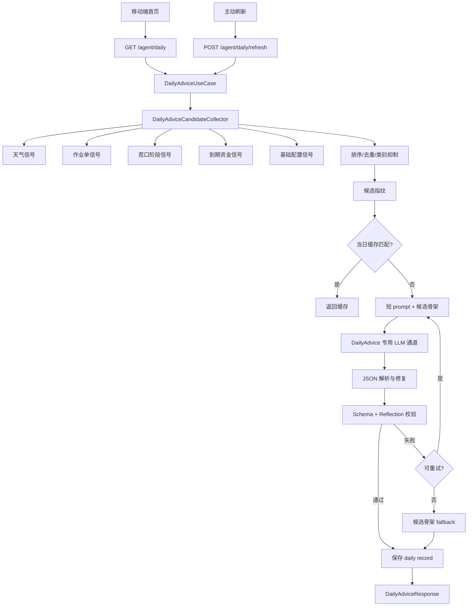

# 今日建议 Skill 设计

> 状态：分析稿  
> 维护：BlockShip  
> 日期：2026-06-22  
> 关联：[Skill 引擎与契约](../02_Skill引擎与契约.md)、[Agent 内部接口](../../03_接口协议/02_Agent内部接口.md)、[HTTP API 协议](../../03_接口协议/01_HTTP_API协议.md)、[天气 Skill](./天气Skill.md)

---

## 1. 背景与目标

今日建议服务首页和主动刷新场景，目标是在用户打开 App 时直接看到今天最该处理的农事动作。

它不是普通聊天问答 Skill，而是**系统编排型 Skill**：

| 场景 | 入口 | 目标 |
| --- | --- | --- |
| 首页建议 | `GET /agent/daily` | 返回今日可执行建议，命中缓存时快速响应 |
| 主动刷新 | `POST /agent/daily/refresh` | 清除当日缓存后重新收集信号并生成建议 |
| Agent 询问今日安排 | 对话路由可解释已有建议 | 优先读取已生成建议，不重新跑长链路 |

核心目标：**今日建议必须由结构化候选驱动，LLM 只能润色候选文案；LLM 不稳定、超时或 JSON 异常时，系统仍返回可展示的确定性 fallback。**

## 2. 当前问题

| 问题 | 说明 | 风险 |
| --- | --- | --- |
| 复用聊天 Agent | 结构化 JSON 生成曾通过 `invoke_advisor` 进入 LangGraph 聊天图 | 系统 prompt、上下文、历史消息叠加后超预算 |
| JSON 输出不稳定 | 本地/轻量模型可能输出半截 JSON 或混入说明文字 | 首页刷新报 JSON 解析失败 |
| 重试成本高 | 同一超预算 prompt 重试不会改变根因 | `/agent/daily/refresh` 耗时高且仍 fallback |
| 候选与文案混合 | 让 LLM 同时决定“今天做什么”和“怎么写” | 容易把普通经营状态当成今日行动 |
| 可观测不足 | 需要能区分 parse 失败、校验失败、截断、fallback | 难以判断是模型问题还是信号问题 |

## 3. 设计原则

1. **候选先行**：先由后端收集、排序、去重今日行动候选，再进入生成。
2. **LLM 不定责**：LLM 只改写候选文案，不新增候选、不改变来源、不提高优先级。
3. **短 prompt 独立通道**：今日建议生成不进入普通聊天图，不注入会话历史和通用运行时上下文。
4. **确定性 fallback**：任意 LLM 失败都返回候选骨架，不把原始错误文案暴露到首页。
5. **缓存按指纹命中**：当日缓存必须同时匹配 `schema_version` 和 `candidate_fingerprint`。
6. **反重复打扰**：无到期日欠款、未结人工、本月花费等经营状态不能每天作为今日行动。
7. **可追踪**：缓存元数据记录候选、生成模式、重试次数、校验结果和错误码。

## 4. 总体架构



## 5. 信号来源与候选规则

| 来源 | 候选类型 | 入选条件 | 抑制规则 |
| --- | --- | --- | --- |
| 天气 | `weather` | 暴雨、大风、高温、低温等会影响今日作业 | 同类天气最多 1 条 |
| 作业单 | `operation` | 今日到期、逾期、未来 1-2 天需提前安排 | 同类作业最多 2 条 |
| 茬口阶段 | `crop_stage` | 当前生育期有明确管护动作 | 最近已执行同类农事则抑制 |
| 资金事项 | `finance` | 明确到期日的应收/应付事项 | 无到期日欠款不入选 |
| 基础配置 | `setup` | 农场缺少位置、茬口、作物模板等关键数据 | 同类配置最多 1 条 |
| 经营记录 | `record` | 今日无高优先级事项时提醒巡田与补录 | 只作为 empty/fallback 兜底 |

排序规则：

```text
priority 升序
> due_date 距今天更近
> category 固定顺序 weather > operation > crop_stage > finance > setup > record
> candidate.id 稳定排序
```

## 6. 生成链路

### 6.1 候选骨架

后端先把候选转换为 `AdviceItem` 骨架，包含稳定字段：

```json
{
  "id": "operation:work_order:7",
  "category": "operation",
  "source_type": "operation_work_order",
  "source_id": 7,
  "priority": 1,
  "compact": {
    "title": "今日完成追肥",
    "subtitle": "玉米拔节期作业单今日到期，需要安排人员执行。",
    "icon": "ClipboardList",
    "icon_color": "green"
  },
  "detail_view": {
    "title": "今日完成追肥",
    "description": "玉米拔节期作业单今日到期，需要安排人员执行。依据：作业单日期进入今日建议窗口",
    "evidence": [],
    "steps": [],
    "related": [],
    "actions": [{"type": "ask_agent", "label": "问问芽芽"}]
  }
}
```

LLM 可改写字段：

| 可改写 | 说明 |
| --- | --- |
| `preview` | 首页一句话摘要 |
| `overview.score/subtitle/metrics.value/level` | 首页态势文案 |
| `compact.title/subtitle` | 首页列表文案 |
| `detail_view.title/description/evidence/steps/related` | 详情页文案 |

LLM 禁止改写字段：

| 禁止改写 | 原因 |
| --- | --- |
| `id` | 候选稳定标识 |
| `category` | 前端分组和校验依赖 |
| `source_type/source_id` | 证据链来源 |
| `priority` | 业务排序由后端控制 |
| `generation.schema_version/candidate_fingerprint` | 缓存一致性 |

### 6.2 LLM 通道

今日建议使用专用短 prompt 通道：

```text
DailyAdviceUseCase
  -> generate_daily_advice()
  -> invoke_daily_advice_llm()
  -> invoke_advisor(call_type="daily_advice")
  -> _invoke_direct_daily_advice_llm()
  -> get_llm(role="generation").ainvoke([HumanMessage(prompt)])
```

硬性约束：

1. `call_type="daily_advice"` 不进入 LangGraph 聊天图。
2. 不读取会话历史、不绑定工具、不追加普通聊天 system prompt。
3. 不执行 pending action。
4. 输出必须由 `DailyAdviceResponse` 和每日建议 Reflection 双重校验。
5. 解析失败、校验失败、截断、非建议文本都由编排层 fallback。

## 7. 缓存与刷新

缓存记录写入 `agent_records`：

| 字段 | 值 |
| --- | --- |
| `record_type` | `daily` |
| `content` | `DailyAdviceResponse.model_dump_json()` |
| `farm_id` | 当前农场 |
| `cycle_id` | 可空 |
| `meta.schema_version` | `daily_advice_v2` |
| `meta.candidate_fingerprint` | 候选集合短指纹 |
| `meta.generation_mode` | `llm` / `repaired` / `fallback` / `empty` |
| `meta.validation_errors` | 去重错误码 |
| `meta.selected_candidates` | 入选候选元数据 |

命中条件：

```text
created_at >= 今日 00:00
AND record_type = daily
AND schema_version = daily_advice_v2
AND candidate_fingerprint = 当前候选指纹
```

刷新规则：

1. `POST /agent/daily/refresh` 删除今日匹配记录。
2. 重新收集候选并生成。
3. 即使 LLM 失败，也缓存 fallback，避免用户连续刷新触发同类失败。

## 8. 输出契约

```json
{
  "cycle_id": 1,
  "preview": "强降雨前先排水",
  "overview": {
    "score": 55,
    "subtitle": "今日有强降雨，优先处理排水和到期作业",
    "metrics": [
      {"key": "weather", "label": "天气", "value": "强降雨", "level": "urgent", "icon": "CloudSun"},
      {"key": "work_order", "label": "作业", "value": "2项", "level": "important", "icon": "ClipboardList"},
      {"key": "pending", "label": "待处理", "value": "1项", "level": "important", "icon": "Bell"}
    ]
  },
  "items": [],
  "generation": {
    "schema_version": "daily_advice_v2",
    "mode": "llm",
    "retry_count": 0,
    "cache_hit": false,
    "candidate_fingerprint": "336e417c445dde62"
  },
  "created_at": "2026-06-22T08:00:00"
}
```

## 9. 错误码与降级

| code | 场景 | 处理 |
| --- | --- | --- |
| `llm_json_parse_failed` | LLM 返回非合法 JSON | 带修复提示重试 |
| `llm_json_truncated` | JSON 在字符串中途截断 | 不重试，直接 fallback |
| `empty_or_non_advice_llm_response` | 配额、错误文案、空回复 | 重试后 fallback |
| `candidate_id_not_allowed` | LLM 新增或篡改候选 id | 重试后 fallback |
| `daily_advice_content_too_thin` | 文案过短或不满足展示要求 | 带修复提示重试 |
| `forbidden_daily_advice_topic` | 输出了无到期欠款、未结人工等禁用主题 | 重试后 fallback |

降级优先级：

```text
LLM 合法且校验通过
> LLM 修复后通过
> 候选 skeleton fallback
> empty response
```

## 10. 与普通 Skill 的边界

今日建议是系统编排型 Skill，不建议注册成普通对话工具：

| 能力 | 普通 Skill | 今日建议 |
| --- | --- | --- |
| 触发方式 | LLM 工具调用 | 首页/API/System job |
| 参数来源 | 用户自然语言 | 农场、候选信号、缓存 |
| 是否写入业务数据 | 由 Skill 类型决定 | 只写 `agent_records` 缓存 |
| 是否需要 pending | 写操作需要 | 不需要 |
| 是否走聊天图 | 是 | 否 |
| 输出 | 自然语言 + data | `DailyAdviceResponse` |

如果用户在对话中问“今天该干什么”，推荐行为：

1. 若今日已生成建议，读取并总结缓存。
2. 若没有缓存，可调用 `GET /agent/daily` 对应 use case。
3. 不让聊天 LLM 临时自由生成今日建议。

## 11. Trace 与可观测

建议记录：

```json
{
  "call_type": "daily_advice",
  "schema_version": "daily_advice_v2",
  "candidate_fingerprint": "336e417c445dde62",
  "selected_candidates": 5,
  "generation_mode": "fallback",
  "retry_count": 0,
  "validation_errors": ["llm_json_truncated"],
  "cache_hit": false,
  "llm_channel": "direct_short_prompt"
}
```

关键告警：

| 指标 | 告警含义 |
| --- | --- |
| `llm_json_truncated` 连续升高 | 模型输出长度或 prompt 仍需压缩 |
| `fallback` 占比升高 | LLM 质量或 prompt 合约退化 |
| `empty` 占比异常升高 | 信号收集可能失效 |
| `candidate_fingerprint` 高频变化 | 候选排序或信号源不稳定 |

## 12. 测试策略

| 层级 | 测试 |
| --- | --- |
| 候选收集 | 天气、作业、茬口、资金、配置候选单元测试 |
| 排序去重 | priority、due_date、类别上限、dedupe key |
| 生成编排 | parse 失败重试、截断直接 fallback、校验失败 fallback |
| 架构边界 | `call_type=daily_advice` 不进入聊天图 |
| API | `GET /agent/daily`、`POST /agent/daily/refresh` 响应符合 v2 schema |
| 缓存 | 当日缓存命中、候选指纹变化时失效 |

最小回归命令：

```bash
backend/.venv/bin/python -m pytest \
  backend/tests/test_daily_advice_generation.py \
  backend/tests/test_agent_service.py::TestGetDailyAdvice \
  backend/tests/test_structured_advice.py::TestDailyAdviceFallback \
  backend/tests/test_structured_advice.py::TestRefreshDailyAdvice \
  backend/tests/agents/test_guardrails_integration.py::TestAdvisorGuardrails::test_daily_advice_uses_direct_llm_without_chat_graph \
  -q
```

## 13. 验收标准

| 场景 | 期望 |
| --- | --- |
| 有高优先级候选 | 返回 1-5 条结构化建议 |
| 无候选 | 返回 `mode=empty`，不调用 LLM |
| LLM 返回合法 JSON | 校验通过后缓存 `mode=llm` |
| 首次文案校验失败 | 带修复提示重试，成功后 `mode=repaired` |
| LLM JSON 截断 | 只调用一次 LLM，返回 `mode=fallback`，记录 `llm_json_truncated` |
| LLM 输出旧数组格式 | 不缓存旧格式，重试后 fallback |
| 刷新接口 | 删除今日缓存后重新生成，失败也返回可展示 fallback |
| 普通聊天上下文很长 | 不影响今日建议 prompt 预算 |
| 无到期日欠款/未结人工 | 不作为今日建议 item 出现 |

