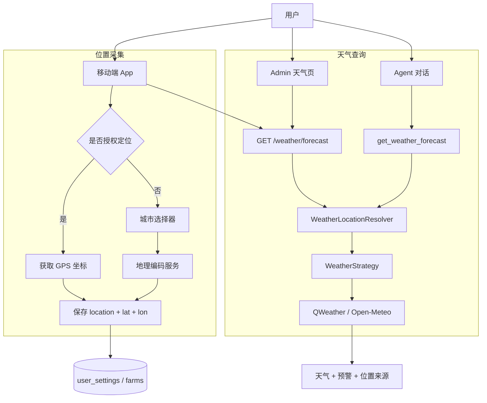
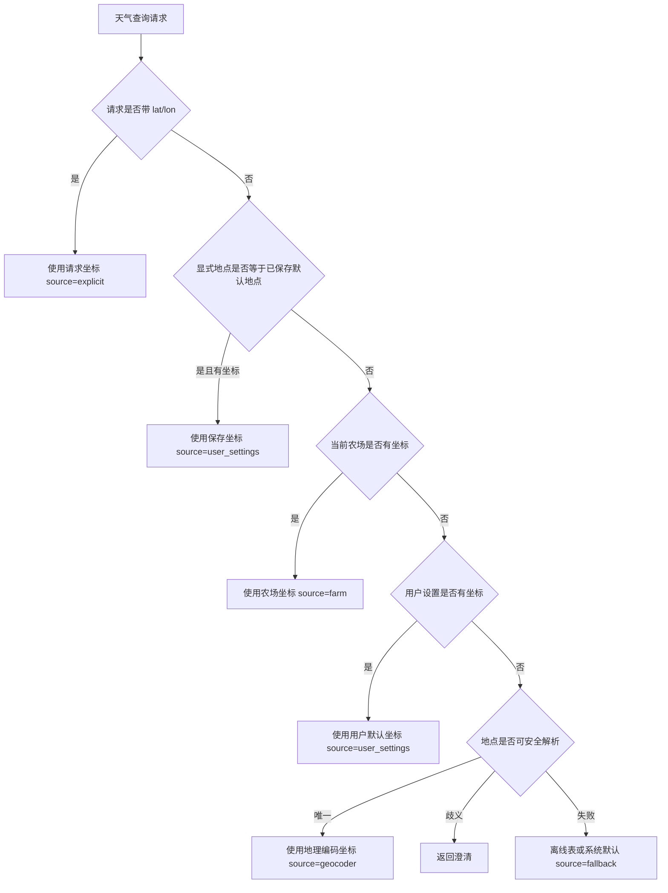
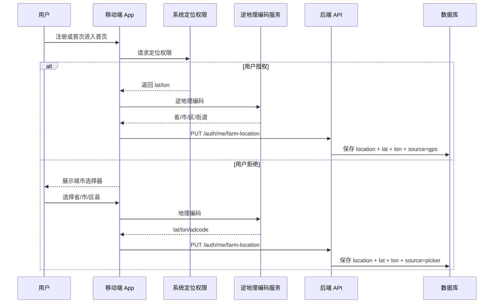
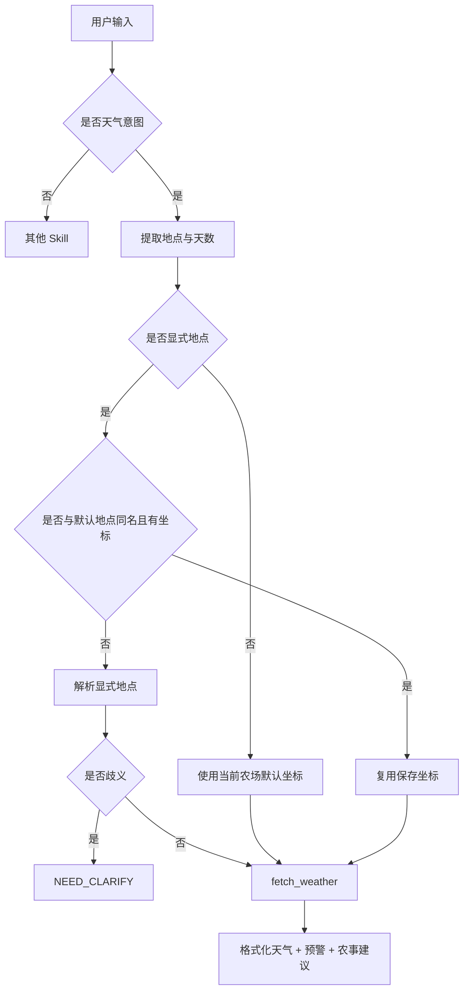
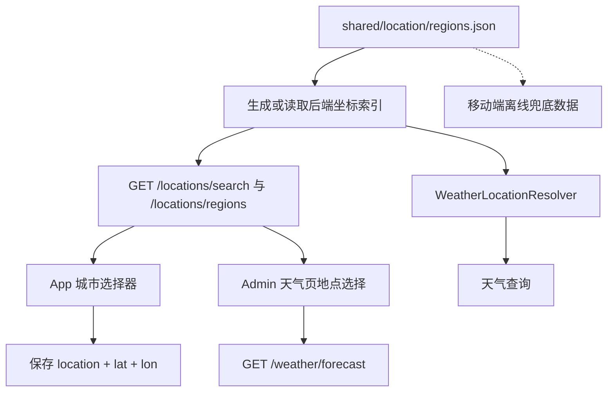

# 天气 Skill 设计

> 状态：分析稿  
> 维护：BlockShip  
> 日期：2026-06-22  
> 关联：[Skill 引擎与契约](../02_Skill引擎与契约.md)、[前端与移动端契约](../09_前端与移动端契约.md)、[HTTP API 协议](../../03_接口协议/01_HTTP_API协议.md)、[外部服务接口](../../03_接口协议/03_外部服务接口.md)

---

## 1. 背景与目标

天气 Skill 服务三类场景：

| 场景 | 入口 | 目标 |
| --- | --- | --- |
| 默认农场天气 | 移动端首页、Admin 天气页、每日建议 | 使用当前农场或用户默认坐标查询真实天气 |
| Agent 问天气 | `get_weather_forecast` | 支持“我这里”“苏州”“徐州鼓楼区”等自然语言位置 |
| 农事决策 | Agent、每日建议、天气页 | 输出降雨、风速、高温、预警和农事建议 |

核心目标：**天气查询必须优先使用可信经纬度；缺少坐标时才解析地名；地名歧义时必须澄清，不能静默返回错城市天气。**

## 2. 当前问题

| 问题 | 说明 | 风险 |
| --- | --- | --- |
| 文本地点优先 | `location=虎丘区` 如果不带坐标，Provider 可能解析漂移 | 返回虚假天气 |
| 内置坐标粗糙 | 当前内置表中 `虎丘区` 实际是苏州市中心坐标 | 区县/地块天气不准 |
| 重名区县 | `鼓楼区` 可能是南京或徐州 | 查错城市 |
| App 坐标链路不完整 | 用户授权定位后应保存 `lat/lon`，未授权应走城市选择器补坐标 | 默认天气不稳定 |
| Agent 参数不统一 | Skill 文档使用 `location`，旧实现只读 `city` | LLM 传参被忽略 |
| 可观测不足 | Trace 缺少位置来源、坐标来源、Provider 信息 | 难以排查天气错误 |
| 坐标数据源分裂 | 后端 `city_coords.py` 与移动端城市坐标数据各自维护 | 两端查询结果可能不一致 |

## 3. 设计原则

1. **坐标优先**：只要有可信 `lat/lon`，天气查询必须直接用坐标。
2. **文本展示**：`location` 主要用于展示、预警筛选和地理编码辅助，不作为最终可信定位。
3. **同名复用**：用户问的地点与默认地点同名，且数据库有坐标时，直接复用保存坐标。
4. **外地显式优先**：用户问外地天气时，不使用用户当前位置。
5. **歧义不猜**：`鼓楼区` 这类裸区名没有坐标时必须澄清。
6. **来源可追踪**：天气结果必须记录 `location_source` 和 `location_precision`。
7. **单一坐标源**：城市/区县坐标统一维护一份 JSON 数据源，后端和移动端都从该数据源读取或生成代码。

## 4. 总体架构



## 5. 位置解析优先级



优先级结论：

```text
请求 lat/lon
> 同名默认地点保存坐标
> 农场坐标
> 用户默认坐标
> 地理编码服务
> 离线坐标表
> 系统默认坐标
```

## 6. 注册与 App 定位流程



保存规则：

| 字段 | 要求 | 说明 |
| --- | --- | --- |
| `location` | 必填 | 展示名，如 `苏州市虎丘区` |
| `lat` | 推荐必填 | 纬度 |
| `lon` | 推荐必填 | 经度 |
| `source` | 推荐 | `gps`、`picker`、`geocoder`、`manual` |
| `precision` | 推荐 | `gps`、`district`、`city`、`fallback` |
| `adcode` | 推荐 | 行政区划编码，用于消除重名 |

## 7. Agent 天气查询规则



典型规则：

| 用户问法 | 行为 |
| --- | --- |
| “我这里天气” | 用当前农场或默认用户坐标 |
| “虎丘区天气” | 若默认地点同名且有坐标，用保存坐标；否则地理编码 |
| “苏州天气” | 查苏州，不使用用户当前位置 |
| “徐州鼓楼区天气” | 查徐州鼓楼区 |
| “鼓楼区天气” | 默认地点同名且有坐标则用坐标，否则澄清 |

歧义澄清话术：

```text
“鼓楼区”可能对应多个城市，请补充上级城市或经纬度，例如“南京鼓楼区”或“徐州鼓楼区”。
```

## 8. Skill 参数契约

```json
{
  "type": "object",
  "properties": {
    "location": {
      "type": "string",
      "description": "要查询的地点，如苏州、虎丘区、徐州鼓楼区。不传则使用当前农场默认位置。"
    },
    "days": {
      "type": "integer",
      "description": "预报天数，默认 3，最大 7。"
    }
  },
  "required": []
}
```

兼容旧参数：

```json
{
  "city": "苏州"
}
```

## 9. HTTP API 契约

### 9.1 保存默认农场位置

```http
PUT /auth/me/farm-location
Content-Type: application/json

{
  "location": "苏州市虎丘区",
  "lat": 31.3000,
  "lon": 120.5700,
  "farm_id": 1,
  "source": "gps",
  "precision": "gps",
  "adcode": "320505"
}
```

当前已支持：`location`、`lat`、`lon`、`farm_id`。  
建议扩展：`source`、`precision`、`adcode`。

### 9.2 查询天气

```http
GET /weather/forecast?days=7&location=虎丘区&lat=31.3000&lon=120.5700
Authorization: Bearer <token>
```

建议响应增加位置元数据：

```json
{
  "location": "苏州市虎丘区",
  "lat": 31.3000,
  "lon": 120.5700,
  "location_source": "gps",
  "location_precision": "gps",
  "provider": "qweather",
  "current_weather": {
    "temperature": 23
  },
  "daily": {},
  "warnings": []
}
```

## 10. 错误码

| HTTP | code | 场景 | 处理 |
| --- | --- | --- | --- |
| 400 | `WEATHER_LOCATION_AMBIGUOUS` | 地点重名且无坐标 | 要求补上级城市或展示城市选择器 |
| 400 | `WEATHER_LOCATION_MISSING` | 无默认位置且未传地点 | 引导设置默认位置 |
| 502 | `WEATHER_PROVIDER_FAILED` | 天气 Provider 不可用 | 稍后重试或降级 |
| 503 | `GEOCODER_UNAVAILABLE` | 地理编码不可用 | 使用离线兜底或稍后重试 |

## 11. 外部服务选型

| 方案 | 优点 | 风险 | 建议 |
| --- | --- | --- | --- |
| 高德地理编码 | 国内行政区划准确，支持 adcode | 需要 Key 和配额 | 推荐作为主 geocoder |
| 和风 GeoAPI | 与天气同源 | 当前项目实测失败会回落默认坐标 | 不作为唯一 geocoder |
| geopy + Nominatim | Python 生态成熟 | 国内地址准确性和限频风险 | 备选 |
| 离线行政区划表 | 无外部依赖 | 精度粗、维护成本高 | 仅兜底 |

推荐：**高德地理编码作为主服务，离线表作为兜底，天气 Provider 只负责天气。**

## 12. 坐标数据源治理

### 12.1 统一数据源

后续不再分别维护：

```text
backend/app/modules/farm/city_coords.py
mobile-app/lib/data/location/cities.dart
```

而是统一维护一份 JSON 数据源：

```text
shared/location/regions.json
```

当前已落地第一步：`shared/location/regions.json` 已从移动端现有城市选择器数据生成全量省市区县记录，并通过网络开源数据源 `pfinal/city` 的 `region.sql` 校准大部分区县坐标；后端 `city_coords.py` 会优先读取该 JSON，旧内置坐标表只作为迁移期兜底。移动端仍保留现有 Dart 数据，后续应从该 JSON 生成或同步，避免继续分裂。

当前数据源状态：

| 类别 | 数量 | 说明 |
| --- | ---: | --- |
| 总记录 | 3366 | 来自现有城市选择器的省市区县 |
| 网络源校准 | 3263 | `pfinal/city` 百度坐标转 WGS84 近似 |
| 人工校准 | 3 | `苏州市虎丘区`、`徐州市鼓楼区`、`南京市鼓楼区` |
| 未匹配兜底 | 100 | 保留移动端原坐标，后续继续校准 |

后端和移动端使用方式：



### 12.1.1 三端共用方式

| 端 | 使用方式 | 当前状态 |
| --- | --- | --- |
| Backend | 直接读取 `shared/location/regions.json`，供天气解析和 `/locations` API 使用 | 已接入 |
| App | 城市选择器搜索优先请求 `/locations/search`；本地 Dart 表保留为离线/失败兜底 | 已接入 |
| Admin | 天气页通过 `/locations/search` 选择地点，并将返回的 `lat/lon` 传给 `/weather/forecast` | 已接入 |

共用原则：

1. App/Admin 不直接复制维护坐标表。
2. App/Admin 保存或查询天气时必须带上 `/locations` 返回的 `lat/lon`。
3. 后端 Agent、天气 API、农事建议统一使用 `WeatherLocationResolver`，最终都落到同一份 JSON 或用户保存坐标。
4. 移动端离线场景可以缓存 `/locations/regions` 结果，但缓存版本必须跟 `regions.json.version` 对齐。

位置 API 契约：

```http
GET /locations/meta
GET /locations/search?q=虎丘&limit=20
GET /locations/regions?province=江苏省&city=苏州市
```

`/locations/search` 返回字段必须至少包含：

```json
{
  "display_name": "苏州市虎丘区",
  "adcode": "320505",
  "lat": 31.3296,
  "lon": 120.4342,
  "coordinate_system": "WGS84_MANUAL",
  "coordinate_source": "manual_verified"
}
```

### 12.2 JSON 结构

```json
{
  "version": "2026-06-22",
  "source": "generated from mobile-app city picker; calibrated with pfinal/city region.sql bd09ll coordinates converted to WGS84 approximation; manual overrides for verified farm-manager hot spots",
  "source_urls": [
    "https://github.com/pfinal/city",
    "https://raw.githubusercontent.com/pfinal/city/master/region.sql"
  ],
  "coordinate_note": "Most calibrated coordinates are WGS84 approximations converted from BD-09; use GPS or provider geocoding when higher precision is required.",
  "regions": [
    {
      "province": "江苏省",
      "city": "苏州市",
      "district": "虎丘区",
      "name": "虎丘区",
      "full_name": "江苏省苏州市虎丘区",
      "display_name": "苏州市虎丘区",
      "adcode": "320505",
      "lat": 31.3296,
      "lon": 120.4342,
      "level": "district",
      "coordinate_system": "WGS84_MANUAL",
      "coordinate_source": "manual_verified",
      "aliases": ["苏州虎丘区", "苏州市虎丘区", "虎丘区"]
    }
  ]
}
```

字段说明：

| 字段 | 说明 |
| --- | --- |
| `province` | 省级行政区 |
| `city` | 地级市 |
| `district` | 区县，市级记录可为空 |
| `name` | 原始名称 |
| `full_name` | 省市区完整名称，用于消除重名 |
| `display_name` | 前端展示名称 |
| `adcode` | 行政区划编码，用于稳定标识 |
| `lat/lon` | 行政区代表坐标 |
| `level` | `province`、`city`、`district` |
| `coordinate_system` | 坐标系或转换说明，如 `WGS84_MANUAL`、`WGS84_APPROX_FROM_BD09` |
| `coordinate_source` | 坐标来源，如 `manual_verified`、`pfinal_city_region_sql_bd09ll_converted` |
| `aliases` | 常见别名或用户输入匹配词 |

### 12.3 覆盖范围

坐标数据源必须覆盖：

1. 全国省级行政区。
2. 全国地级市。
3. 全国区县级行政区。
4. 常见重名区县的完整 disambiguation，如 `南京市鼓楼区`、`徐州市鼓楼区`。
5. 项目重点地区优先校准更准确坐标，如 `苏州市虎丘区`、`吴中区`、`相城区`、`徐州市睢宁县`。

### 12.4 维护规则

1. **禁止手写两份坐标表**：所有城市/区县坐标先改 `shared/location/regions.json`。
2. **后端派生**：后端可在启动时读取 JSON，或通过脚本生成 `city_coords.py`。
3. **移动端派生**：移动端城市选择器从同一 JSON 生成 Dart 数据或打包 JSON。
4. **重名规则**：裸 `district` 重名时，城市选择器必须展示 `city + district`，后端裸名查询必须澄清。
5. **坐标系必须标记**：网络源若不是 WGS84，需要转换并写入 `coordinate_system`，不能把 BD-09/GCJ-02 当 GPS 直接使用。
6. **坐标精度标记**：JSON 坐标属于行政区代表坐标，`location_precision=district`，不能伪装成 GPS。
7. **版本管理**：数据源需要记录版本和更新时间，坐标更新应同步回归测试。

### 12.5 数据源优先级中的位置

统一 JSON 是兜底坐标源，不替代用户真实坐标：

```text
GPS 坐标
> 用户选择器保存的 JSON 坐标
> 用户设置已保存坐标
> 本次显式地点在 JSON 中唯一匹配
> 系统默认坐标
```

说明：

- 用户授权定位时，保存 GPS 坐标。
- 用户未授权但手动选择城市时，保存 JSON 中对应区县坐标。
- Agent 问别的城市天气时，可用 JSON 解析本次显式地点。
- JSON 查询不到或重名时，返回澄清。

## 13. Trace 与隐私

天气查询 Trace 建议记录：

```json
{
  "skill": "get_weather_forecast",
  "input_location": "鼓楼区",
  "resolved_location": "徐州鼓楼区",
  "lat": 34.28889,
  "lon": 117.18559,
  "location_source": "user_settings",
  "location_precision": "district",
  "provider": "qweather",
  "cache_hit": false,
  "warnings_count": 2
}
```

隐私规则：

1. 经纬度属于敏感个人信息。
2. App 仅在用户授权或主动选择位置时上传。
3. 生产日志不记录完整 GPS，可保留 3 位小数或只记录 source。
4. 数据飞轮样本导出时必须脱敏坐标。

## 14. 实施任务

| 阶段 | 任务 |
| --- | --- |
| Phase 1 | 修正 `WeatherLocationResolver`，坐标优先、歧义澄清、Trace 增加位置来源 |
| Phase 2 | 移动端注册/设置页接入定位权限与城市选择器；城市选择器搜索优先调用 `/locations/search`，本地 Dart 表只作离线/失败兜底 |
| Phase 3 | 建立 `shared/location/regions.json`，补齐全国城市与区县坐标；当前已从移动端城市选择器生成 3000+ 条基础记录 |
| Phase 4 | 后端和移动端改为从统一 JSON 派生坐标索引；当前后端已优先读取 JSON，移动端待同步 |
| Phase 5 | 扩展 `farms/user_settings` 位置字段：`source/precision/adcode` |
| Phase 6 | Admin 天气页接入 `/locations/search`，调用天气接口时传 `location + lat + lon`；后续补充坐标来源、Provider 和调试参数展示 |
| Phase 7 | 建立天气回归集：虎丘区、吴中区、鼓楼区、外地天气 |

## 15. 验收标准

| 场景 | 期望 |
| --- | --- |
| 用户授权定位 | 天气查询使用 GPS 坐标 |
| 用户拒绝定位但选择城市 | 天气查询使用统一 JSON 中的选择器坐标 |
| 用户默认 `鼓楼区` 且有坐标 | Agent 问“鼓楼区天气”直接用保存坐标 |
| 用户无默认坐标问“鼓楼区天气” | Agent 澄清南京/徐州等上级城市 |
| 用户默认苏州问“徐州天气” | 查询徐州，不使用苏州坐标 |
| Admin 天气页 | 展示地点、坐标来源、Provider、预警 |
| 后端与移动端坐标 | 同一个地区的坐标来自同一份 JSON，不允许两端不一致 |
