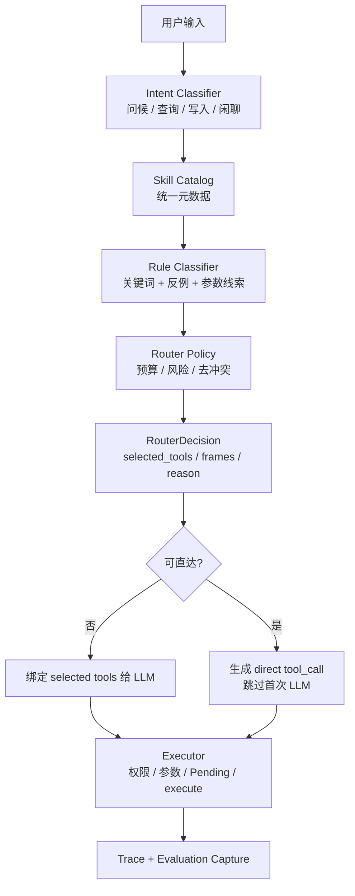

# 12 — Skill 路由选择架构

> 状态：草稿 | 维护：BlockShip | 关联：[01_Agent平台架构](./01_Agent平台架构.md)、[02_Skill引擎与契约](./02_Skill引擎与契约.md)、[05_系统测试/04_Evaluation评测](../05_系统测试/04_Evaluation评测.md)

---

## 1. 目标

Skill 路由选择负责把用户自然语言输入收敛为本轮可用的 Skill 集合，并决定是否可以跳过 LLM 工具选择直接执行只读 Skill。

它解决 4 个问题：

1. **准确性**：应该调用哪个 Skill，不误选、不漏选。
2. **安全性**：写操作必须进入 Pending Action，不允许直接执行。
3. **成本与延迟**：只向 LLM 暴露必要 tools schema，减少 token 与首包时间。
4. **可回归**：每个 Skill 至少有选择用例，路由策略变更必须被测试集捕获。

## 2. 设计原则

| 原则 | 说明 |
| --- | --- |
| 单一事实来源 | Skill 元数据、触发词、反例、权限、上下文依赖由统一 catalog 管理，不在多处硬编码漂移。 |
| 精确优先 | 精确业务查询优先于泛化农场状态。例如“我的工人”必须选 `get_workers`，不应扩展成 `get_farm_status`。 |
| 泛化兜底 | 只有“农场最近怎么样”“整体情况”等泛化问题才兜底到 `get_farm_status`。 |
| 写操作保守 | 多写入或歧义写入先澄清，最多绑定一个写操作 Skill。 |
| 直达可解释 | 只有高置信只读查询可跳过首次 LLM，直达规则必须有单测和 trace。 |
| 测试先行 | 新增或修改 Skill 时必须补充 selection regression case。 |

## 3. 总体流程



## 4. 核心组件

| 组件 | 当前位置 | 职责 | 目标状态 |
| --- | --- | --- | --- |
| Skill Catalog | `agent/router/catalog.py` + `registry.py` | 从工具实例构建候选 Skill 元数据 | 由 `skill.md` frontmatter 自动生成，registry 只保留覆盖项 |
| Rule Classifier | `agent/router/classifier.py` | 把用户输入转为意图帧 `IntentFrame` | 覆盖所有 enabled Skill，并支持反例优先级 |
| Router Policy | `agent/router/policy.py` | 对候选 Skill 做预算、风险、写操作限制 | 与 Evaluation 指标联动，输出完整拒绝原因 |
| Tool Selector | `agent/tool_selector.py` | 历史兼容规则入口 | 收敛到 SkillRouter，避免两套路由规则漂移 |
| Direct Routing | `agent/runtime/direct_routing.py` | 高置信只读 Skill 直达执行 | 仅处理白名单只读工具，不做业务意图纠偏 |
| Trace Recorder | `infra/trace_collector.py` | 记录路由输入、输出、schema 估算 | 每次路由必须记录 `route_source` 与 `reason` |

## 5. RouterDecision 协议

```python
class IntentFrame(BaseModel):
    domain: str
    intent: str
    risk: Literal["read", "write_confirm", "admin", "external_network"]
    entities: list[str]
    candidate_tools: list[str]
    confidence: float
    params_hint: dict | None = None
    requires_confirmation: bool = False
    depends_on: list[str] = []

class RouterDecision(BaseModel):
    frames: list[IntentFrame]
    selected_tools: list[str]
    context_dependencies: list[str]
    fallback: str | None = None
    reason: str
    rejected_tools: list[str] = []
    schema_token_estimate: int = 0
    policy_violations: list[str] = []
    clarification: str | None = None
```

`RouterDecision` 是 Runtime、Trace、Evaluation 共用的路由事实，不允许 Runtime 再用另一套隐藏规则重选工具。

## 6. Skill Catalog 元数据

每个 Skill 必须进入 catalog，字段如下：

| 字段 | 来源 | 用途 |
| --- | --- | --- |
| `tool_name` | `skill.md` | 运行时工具名 |
| `domain` | `skill.md` | 业务域分组 |
| `intents` | `skill.md` | 可处理意图 |
| `risk` | `skill.md` metadata | 权限与 Pending 策略 |
| `trigger_examples` | `skill.md` | 规则和 LLM fallback few-shot |
| `anti_examples` | `skill.md` | 防误选 |
| `context_dependencies` | `skill.md` | ContextBundle 选择 |
| `direct_call` | `skill.md` | 是否允许直达 |
| `direct_return` | `skill.md` | ToolMessage 是否可直接返回用户 |

Catalog 覆盖要求：

| Skill 类别 | 要求 |
| --- | --- |
| enabled read Skill | 至少 1 条 selection case + 1 条 anti-example |
| enabled write Skill | 至少 1 条 selection case + 1 条 Pending case |
| admin / external Skill | 至少 1 条拒绝或权限不足 case |
| deprecated Skill | 不进入候选，不绑定给 LLM |

## 7. 候选选择策略

### 7.1 查询类

查询类 Skill 按“越具体越优先”排序：

1. 用户设置：`get_user_settings`
2. 工人档案：`get_workers`
3. 人工应付：`get_labor_payables`
4. 作业单：`get_operation_work_orders`
5. 种植单元：`get_planting_units`
6. 作物模板：`get_crop_templates`
7. 茬口列表：`get_crop_cycles`
8. 茬口详情：`get_crop_cycle_info`
9. 账务分类：`get_cost_categories`
10. 成本汇总：`get_cost_summary`
11. 欠款汇总：`get_debt_summary`
12. 天气：`get_weather_forecast`
13. 泛化农场状态：`get_farm_status`

`get_farm_status` 只在以下场景使用：

- 用户明确问农场整体情况、综合状态、当前种植概览。
- 每日农事建议需要同时参考天气与农场状态。
- 其他 Skill 的实现结果需要农场上下文时，由 ContextBundle 提供上下文，不通过额外调用 `get_farm_status` 解决。

### 7.2 写操作类

写操作分两类：

| 类型 | 处理 |
| --- | --- |
| 单写入意图明确 | 绑定对应写 Skill，Executor 创建 Pending Action。 |
| 多写入意图 | 拆成 pending plan steps；若依赖关系不明确，先澄清。 |
| 歧义写入 | 不绑定写 Skill，返回 clarification。 |

示例：

| 用户输入 | 期望 |
| --- | --- |
| “新来一个工人李丽工资100一天” | `manage_workers` |
| “安排李丽去水稻采收” | `create_operation_work_order` |
| “帮我处理一下这个工人的事情” | clarification，不绑定写 Skill |

## 8. Tool Chain 策略

历史实现中 `TOOL_CHAIN_MAP` 将大量 read Skill 映射到 `get_farm_status`，容易造成路由污染。目标策略如下：

| 场景 | 是否允许链式扩展 |
| --- | --- |
| 每日农事建议 | 允许 `get_weather_forecast + get_farm_status` |
| 茬口详情需要活跃茬口上下文 | 优先通过 ContextBundle 注入，不额外调用 `get_farm_status` |
| 账务、欠款、工人、分类、设置查询 | 不允许扩展到 `get_farm_status` |
| 写操作 | 不允许链式扩展 |
| 复杂分析 | 由 RouterDecision 明确列出多个 Skill，不走隐式 chain |

禁止用“查询结果通常需要农场整体上下文”为理由给所有读工具追加 `get_farm_status`。上下文需要由 Context 工程解决，Skill 调用只表达用户要查的数据源。

## 9. Direct Routing 策略

Direct Routing 只用于高置信、无副作用、参数可确定的只读查询。

| Skill | direct_call | direct_return | 说明 |
| --- | --- | --- | --- |
| `get_weather_forecast` | true | false | 可直达，最终回复仍可由 LLM 整理 |
| `get_cost_summary` | true | false | 查询真实账务，避免 LLM 漏查 |
| `get_debt_summary` | true | true | 简单汇总可直接返回 |
| `get_workers` | true | true | 列表查询可直接返回 |
| `get_crop_cycles` | true | false | 泛问“我的茬口”可直达 |
| `get_farm_status` | true | false | 仅泛化农场状态可直达 |

禁止规则：

- 不得把 `get_crop_cycle_info + get_farm_status` 默认折叠成 `get_farm_status`，除非用户明确问“整体情况”。
- 不得对写操作 direct_call。
- 不得在 Direct Routing 中补偿上游 classifier 的误判；误判必须回到 classifier/catalog 修复。

## 10. 典型路由矩阵

| 用户问题 | 期望 selected_tools | 不应出现 |
| --- | --- | --- |
| 今天天气 | `get_weather_forecast` | `get_farm_status` |
| 今天适合打药吗 | `get_weather_forecast`, `get_farm_status` | 写操作 Skill |
| 我的余额 | `get_cost_summary` | `get_farm_status` |
| 我还欠多少钱 | `get_debt_summary` | `get_cost_summary` |
| 老王还欠多少人工钱 | `get_labor_payables` | `get_debt_summary` |
| 我的工人 | `get_workers` | `manage_workers`, `get_farm_status` |
| 最近玉米授粉作业有哪些 | `get_operation_work_orders` | `create_operation_work_order` |
| 我的茬口 | `get_crop_cycles` | `get_farm_status` |
| 看一下3号茬口 | `get_crop_cycle_info` | `get_farm_status` |
| 有哪些作物模板 | `get_crop_templates` | `get_crop_cycle_info`, `get_farm_status` |
| 有哪些大棚 | `get_planting_units` | `get_farm_status` |
| 有哪些成本分类 | `get_cost_categories` | `get_cost_summary` |
| 我的默认城市是什么 | `get_user_settings` | `manage_user_settings` |
| 农场最近怎么样 | `get_farm_status` | 写操作 Skill |

## 11. Trace 与可观测

每次路由必须记录 trace event：

```json
{
  "node_type": "skill_router",
  "node_name": "skill_router",
  "input_data": {
    "message": "我的工人"
  },
  "output_data": {
    "selected_tools": ["get_workers"],
    "frames": [{"intent": "query_workers", "confidence": 0.84}],
    "rejected_tools": [],
    "fallback": null,
    "reason": "worker query exact match"
  },
  "token_usage": {
    "schema_token_estimate": 120,
    "usage_source": "router_estimate"
  }
}
```

路由日志必须能回答：

- 本轮为什么选这个 Skill？
- 哪些 Skill 被拒绝，原因是什么？
- 是否经过 direct routing？
- 是否因为 schema budget 或 write budget 被裁剪？
- 是否使用 LLM fallback？

## 12. 回归与评测门禁

### 12.1 单元测试

必须覆盖 4 层：

| 层级 | 测试目标 |
| --- | --- |
| Catalog | enabled / disabled / metadata / schema token estimate |
| Classifier | 用户输入到 IntentFrame |
| Policy | 写操作预算、schema 预算、歧义澄清 |
| Direct Routing | 直达白名单、参数补全、禁止折叠 |

### 12.2 批量路由回归

维护 `skill_router_regression` 用例集，每条用例包含：

```json
{
  "id": "worker-list-basic",
  "message": "我的工人",
  "expected_selected_tools": ["get_workers"],
  "forbidden_tools": ["manage_workers", "get_farm_status"],
  "expected_direct_tools": ["get_workers"],
  "tags": ["labor", "read", "direct"]
}
```

门禁：

| 指标 | 要求 |
| --- | --- |
| `selection_accuracy` | >= 0.95 |
| `forbidden_tool_rate` | = 0 |
| `write_bypass_rate` | = 0 |
| `farm_status_pollution_rate` | <= 0.05 |
| `direct_route_misfold_rate` | = 0 |

### 12.3 发现问题后的处理

1. 先把失败输入加入回归集。
2. 定位发生层级：Catalog / Classifier / Policy / Chain / Direct Routing。
3. 只修根因，不在下游补丁绕过。
4. 复跑批量路由回归 + 相关 Skill 单测。

## 13. 演进路线

| 阶段 | 目标 | 输出 |
| --- | --- | --- |
| Phase A | 收敛规则漂移 | Runtime 与 Planner 共用 `SkillRouter`，移除隐式 chain 扩展 |
| Phase B | Catalog 自动化 | 从 `skill.md` 生成 catalog，静态 registry 只保留覆盖项 |
| Phase C | 路由评测集 | 建立 100 条核心 selection regression cases |
| Phase D | LLM fallback | 规则 miss 时调用轻量分类模型，输出受限 JSON |
| Phase E | DataFlywheel 闭环 | trace bad case 自动进入 repair_candidates |

## 14. 相关文档

- [01_Agent平台架构](./01_Agent平台架构.md)
- [02_Skill引擎与契约](./02_Skill引擎与契约.md)
- [03_Context工程](./03_Context工程.md)
- [06_数据飞轮与评测](./06_数据飞轮与评测.md)
- [05_系统测试/02_回归测试集](../05_系统测试/02_回归测试集.md)
- [05_系统测试/04_Evaluation评测](../05_系统测试/04_Evaluation评测.md)
