# 13 — Agent 范式规范化设计

> 状态：草稿 | 维护：BlockShip | 关联：[01_Agent平台架构](./01_Agent平台架构.md)、[02_Skill引擎与契约](./02_Skill引擎与契约.md)、[12_Skill路由选择架构](./12_Skill路由选择架构.md)

---

## 1. 设计目标

本文只规范当前 Farm Manager Agent 的范式边界，不引入重型多 Agent 平台。

目标：

1. 说清楚当前 Agent 是“单主 Agent + Skill 工具 + 触发式反思”，不是自治多 Agent 群。
2. 为多意图输入建立最小前置计划层，避免“无工具调用却声称已记录”。
3. 给 Skill 路由、pending action、pending plan、reflection 规定触发顺序。
4. 给全量 Skill 建立触发树，降低工具误选和遗漏。

非目标：

- 不做新的 Agent 运行时框架。
- 不把每轮请求都交给 LLM critic。
- 不把 Skill 变成互相调用的复杂工作流引擎。
- 不改变现有写操作必须确认的安全边界。

## 2. 当前范式定性

当前系统是一个单 Agent 流水线：

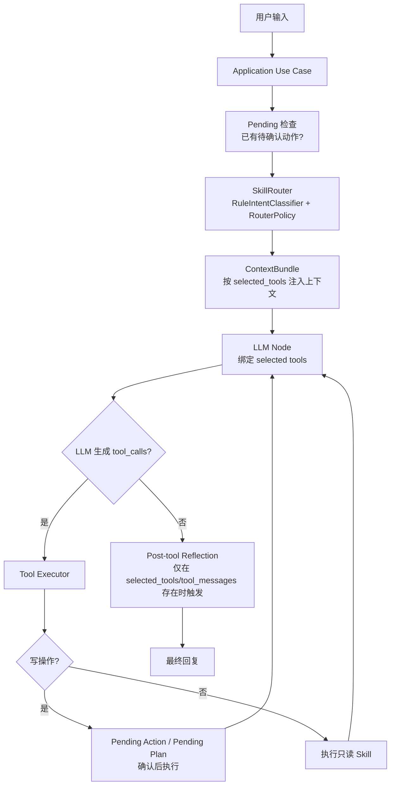
```mermaid
flowchart TD
    U["用户输入"] --> UC["Application Use Case"]
    UC --> P0["Pending 检查<br/>已有待确认动作?"]
    P0 --> R["SkillRouter<br/>RuleIntentClassifier + RouterPolicy"]
    R --> C["ContextBundle<br/>按 selected_tools 注入上下文"]
    C --> L["LLM Node<br/>绑定 selected tools"]
    L --> H{"LLM 生成 tool_calls?"}
    H -->|是| T["Tool Executor"]
    H -->|否| FR["Post-tool Reflection<br/>仅在 selected_tools/tool_messages 存在时触发"]
    T --> W{"写操作?"}
    W -->|是| PA["Pending Action / Pending Plan<br/>确认后执行"]
    W -->|否| RT["执行只读 Skill"]
    PA --> L
    RT --> L
    FR --> O["最终回复"]
```

关键约束：

| 组件 | 当前职责 | 主要缺口 |
| --- | --- | --- |
| `RuleIntentClassifier` | 关键词生成 `IntentFrame` | 对“干了15天压瓜”这类隐式作业/工时句识别不足 |
| `RouterPolicy` | 候选裁剪、写工具预算 | 默认 `max_write_tools=1`，多写入计划会被压扁 |
| `LLM Node` | 绑定候选工具并生成 tool_call | 若无候选工具，模型可能直接文本声称成功 |
| `Tool Executor` | 写操作拦截为 pending | 只有生成了 tool_call 才能创建 pending |
| `Reflector` | 检查 pending 文案、工具失败、工具后回复 | 不是前置语义拆解器，router 无候选时会短路 |

## 3. 当前缺口样例

输入：

> 李海这个月干了15天压瓜

业务语义：

1. `李海` 是工人。
2. `压瓜` 是农事作业。
3. `15天` 是用工数量。
4. `这个月` 是时间范围，但不等同于单个 `work_date`。
5. 若李海有默认日薪且用户未说明已付/不计薪，应推导未付人工。

理想处理：

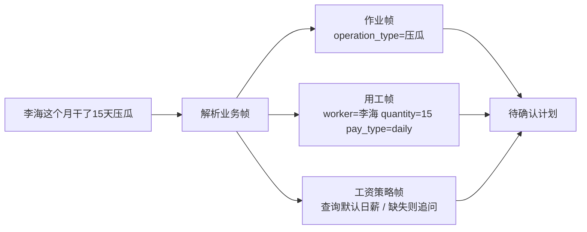
```mermaid
flowchart LR
    A["李海这个月干了15天压瓜"] --> B["解析业务帧"]
    B --> C["作业帧<br/>operation_type=压瓜"]
    B --> D["用工帧<br/>worker=李海 quantity=15 pay_type=daily"]
    B --> E["工资策略帧<br/>查询默认日薪 / 缺失则追问"]
    C --> F["待确认计划"]
    D --> F
    E --> F
```

当前风险：

- router 可能没有生成任何 `IntentFrame`。
- 没有 selected tool 时，post-tool reflection 不运行。
- LLM 可能直接回复“已为您记录”，造成未执行成功话术。

## 4. 规范化目标范式

保留当前单 Agent 架构，只补一个轻量前置语义门：

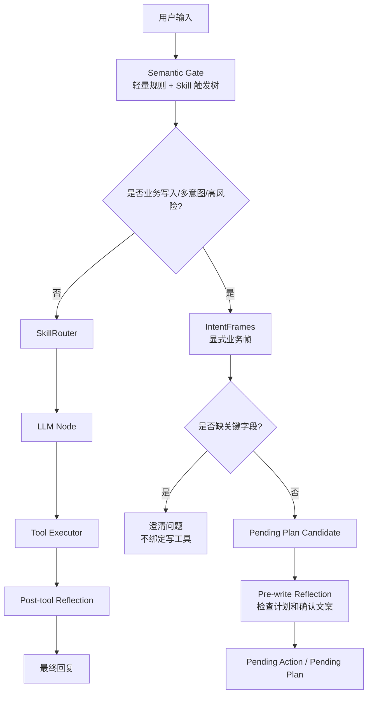
```mermaid
flowchart TD
    U["用户输入"] --> S["Semantic Gate<br/>轻量规则 + Skill 触发树"]
    S --> Q{"是否业务写入/多意图/高风险?"}
    Q -->|否| R["SkillRouter"]
    Q -->|是| F["IntentFrames<br/>显式业务帧"]
    F --> M{"是否缺关键字段?"}
    M -->|是| CL["澄清问题<br/>不绑定写工具"]
    M -->|否| PL["Pending Plan Candidate"]
    PL --> PR["Pre-write Reflection<br/>检查计划和确认文案"]
    PR --> PA["Pending Action / Pending Plan"]
    R --> L["LLM Node"]
    L --> T["Tool Executor"]
    T --> POST["Post-tool Reflection"]
    POST --> O["最终回复"]
```

最小新增概念：

| 概念 | 说明 | 是否必须新建模块 |
| --- | --- | --- |
| Semantic Gate | 前置判断“是否应进入业务帧/计划”，防止无工具成功话术 | 不必须，可先放在 router classifier 内 |
| IntentFrame 增强 | 为同一句话表达作业、用工、工资策略等多个帧 | 复用现有模型 |
| Plan Candidate | 仅用于写操作确认前展示，不直接执行 | 复用 pending plan |
| Pre-final Guard | 没有 selected tool 但回复含成功写入话术时 fail-closed | 可扩展现有 reflection |

### 4.1 长期语义解析分层

Semantic Gate 不能长期演变成“正则集合”。正则只能承担安全门和高频稳定表达兜底，不承担完整自然语言理解。

长期分层：

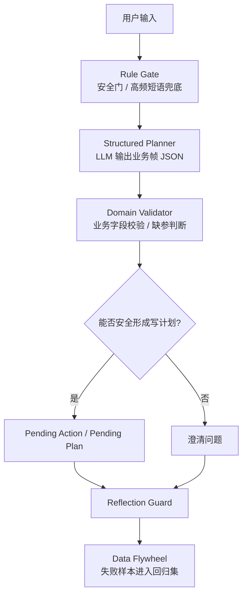
```mermaid
flowchart TD
    U["用户输入"] --> G["Rule Gate<br/>安全门 / 高频短语兜底"]
    G --> P["Structured Planner<br/>LLM 输出业务帧 JSON"]
    P --> V["Domain Validator<br/>业务字段校验 / 缺参判断"]
    V --> C{"能否安全形成写计划?"}
    C -->|是| PA["Pending Action / Pending Plan"]
    C -->|否| Q["澄清问题"]
    PA --> R["Reflection Guard"]
    Q --> R
    R --> D["Data Flywheel<br/>失败样本进入回归集"]
```

职责边界：

| 层 | 可以做 | 不可以做 |
| --- | --- | --- |
| Rule Gate | 问候/查询/明显写操作分流；识别高风险成功话术；覆盖少量稳定短语 | 为每种业务说法不断追加正则 |
| Structured Planner | 输出 `intent_frames`、`entities`、`missing_fields`、`confidence`、`risk` | 直接执行写入或绕过 pending |
| Domain Validator | 校验工人、地块、茬口、默认工资、金额、时间范围是否可唯一确定 | 盲信 Planner 抽取结果 |
| Pending | 把可执行写计划转为用户确认 | 未确认直接落库 |
| Reflection | 没有工具或 pending 证据时禁止“已记录/已创建” | 替代业务规划 |
| Data Flywheel | 把失败样本沉淀为回归用例和评测项 | 只把 bad reply 当训练语料 |

演进约束：

1. 新增正则前必须先判断它属于安全门、负例门，还是高频稳定表达；若不是，应优先进入 Planner/Validator 设计。
2. 任何新增正则必须配套正例和负例测试，避免扩大误触发面。
3. 当同一业务域出现 3 个以上相似正则补丁时，应升级为结构化 Planner schema，而不是继续追加正则。
4. Planner 输出必须是结构化 JSON，不允许只靠自然语言解释驱动写操作。
5. Validator 是最终业务安全边界：工资、欠款、地块、日期、工人身份不确定时必须澄清。

## 5. Agent 输入后的完整生命周期

长期目标是所有会话轮次都经过轻量 `PlanDraft`，但不是每轮都调用 LLM 深度规划。`PlanDraft` 是单主 Agent 内部的结构化运行时数据，用来统一表达“直接回复、读取、单写入、多写入、澄清”五类结果。

### 5.1 总体生命周期

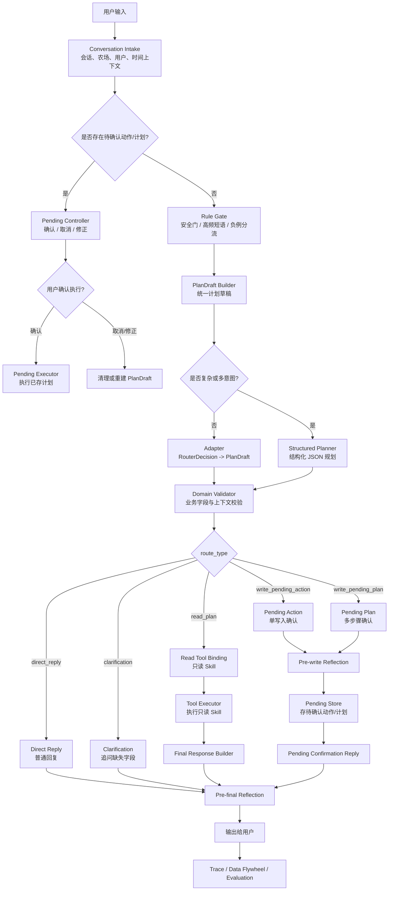
```mermaid
flowchart TD
    U["用户输入"] --> I["Conversation Intake<br/>会话、农场、用户、时间上下文"]
    I --> P0{"是否存在待确认动作/计划?"}
    P0 -->|是| PC["Pending Controller<br/>确认 / 取消 / 修正"]
    PC --> PE{"用户确认执行?"}
    PE -->|确认| EX0["Pending Executor<br/>执行已存计划"]
    PE -->|取消/修正| CLR["清理或重建 PlanDraft"]

    P0 -->|否| G["Rule Gate<br/>安全门 / 高频短语 / 负例分流"]
    G --> PD["PlanDraft Builder<br/>统一计划草稿"]
    PD --> SP{"是否复杂或多意图?"}
    SP -->|否| A1["Adapter<br/>RouterDecision -> PlanDraft"]
    SP -->|是| LP["Structured Planner<br/>结构化 JSON 规划"]
    A1 --> DV["Domain Validator<br/>业务字段与上下文校验"]
    LP --> DV

    DV --> RT{"route_type"}
    RT -->|direct_reply| DR["Direct Reply<br/>普通回复"]
    RT -->|read_plan| RP["Read Tool Binding<br/>只读 Skill"]
    RT -->|write_pending_action| WPA["Pending Action<br/>单写入确认"]
    RT -->|write_pending_plan| WPP["Pending Plan<br/>多步骤确认"]
    RT -->|clarification| CQ["Clarification<br/>追问缺失字段"]

    RP --> TE["Tool Executor<br/>执行只读 Skill"]
    TE --> FR["Final Response Builder"]
    WPA --> WR["Pre-write Reflection"]
    WPP --> WR
    WR --> PS["Pending Store<br/>存待确认动作/计划"]
    PS --> PR["Pending Confirmation Reply"]
    DR --> RF["Pre-final Reflection"]
    CQ --> RF
    FR --> RF
    PR --> RF
    RF --> O["输出给用户"]
    O --> DF["Trace / Data Flywheel / Evaluation"]
```

关键原则：

| 阶段 | 产物 | 说明 |
| --- | --- | --- |
| Conversation Intake | `TurnContext` | 收集会话、用户、农场、时间、pending 状态 |
| Rule Gate | `evidence` | 快速识别问候、查询、明显写入、高风险成功话术 |
| PlanDraft Builder | `PlanDraft` | 所有轮次统一成计划草稿 |
| Domain Validator | `PlanValidationResult` | 业务字段完整性、唯一性、权限、默认值推断 |
| Route Resolver | `route_type` | 决定 direct reply/read/pending action/pending plan/clarification |
| Executor/Pending | `ToolResult` 或 `PendingAction/Plan` | 执行只读；写入只存待确认 |
| Reflection | `ReflectionDecision` | 最终守门，不替代业务规划 |
| Data Flywheel | `case/issue/regression` | 失败沉淀为评测与修复包 |

### 5.2 PlanDraft 数据契约

`PlanDraft` 不是新 Agent，也不是工作流引擎，只是主 Agent 内部的计划契约。

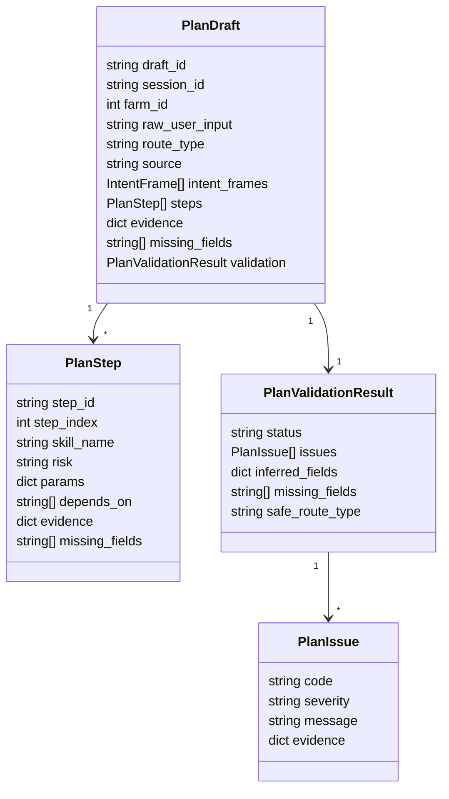
```mermaid
classDiagram
    class PlanDraft {
        string draft_id
        string session_id
        int farm_id
        string raw_user_input
        string route_type
        string source
        IntentFrame[] intent_frames
        PlanStep[] steps
        dict evidence
        string[] missing_fields
        PlanValidationResult validation
    }

    class PlanStep {
        string step_id
        int step_index
        string skill_name
        string risk
        dict params
        string[] depends_on
        dict evidence
        string[] missing_fields
    }

    class PlanValidationResult {
        string status
        PlanIssue[] issues
        dict inferred_fields
        string[] missing_fields
        string safe_route_type
    }

    class PlanIssue {
        string code
        string severity
        string message
        dict evidence
    }

    PlanDraft "1" --> "*" PlanStep
    PlanDraft "1" --> "1" PlanValidationResult
    PlanValidationResult "1" --> "*" PlanIssue
```

`route_type` 只允许五类：

| route_type | 含义 | 后续动作 |
| --- | --- | --- |
| `direct_reply` | 问候、闲聊、解释类安全回复 | 不绑定工具 |
| `read_plan` | 查询农场真实数据或外部信息 | 绑定只读 Skill |
| `write_pending_action` | 单个写操作 | 存 pending action |
| `write_pending_plan` | 多个有依赖的写操作 | 存 pending plan |
| `clarification` | 缺关键字段或歧义 | 追问，不执行 |

### 5.3 PlanDraft 生成来源

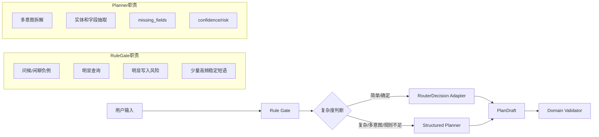
```mermaid
flowchart LR
    U["用户输入"] --> G["Rule Gate"]
    G --> C{"复杂度判断"}
    C -->|简单/确定| A["RouterDecision Adapter"]
    C -->|复杂/多意图/规则不足| L["Structured Planner"]
    A --> D["PlanDraft"]
    L --> D
    D --> V["Domain Validator"]

    subgraph RuleGate职责
        G1["问候/闲聊负例"]
        G2["明显查询"]
        G3["明显写入风险"]
        G4["少量高频稳定短语"]
    end

    subgraph Planner职责
        L1["多意图拆解"]
        L2["实体和字段抽取"]
        L3["missing_fields"]
        L4["confidence/risk"]
    end
```

选择规则：

| 输入类型 | 生成来源 | 原因 |
| --- | --- | --- |
| “你好” | Rule Gate | 无需 LLM 规划 |
| “我的工人有哪些” | RouterDecision Adapter | 明确只读 |
| “昨天买了200块化肥” | RouterDecision Adapter 或轻量 planner | 明确单写入 |
| “李海这个月干了15天压瓜” | Hybrid | 规则可给证据，Validator 决定工资策略 |
| “新来一个工人李丽工资100一天，今天去6号棚收水稻” | Structured Planner / Hybrid | 多意图和步骤依赖 |

### 5.4 Domain Validator 规则

Validator 是系统级安全边界，不属于某个 Skill。

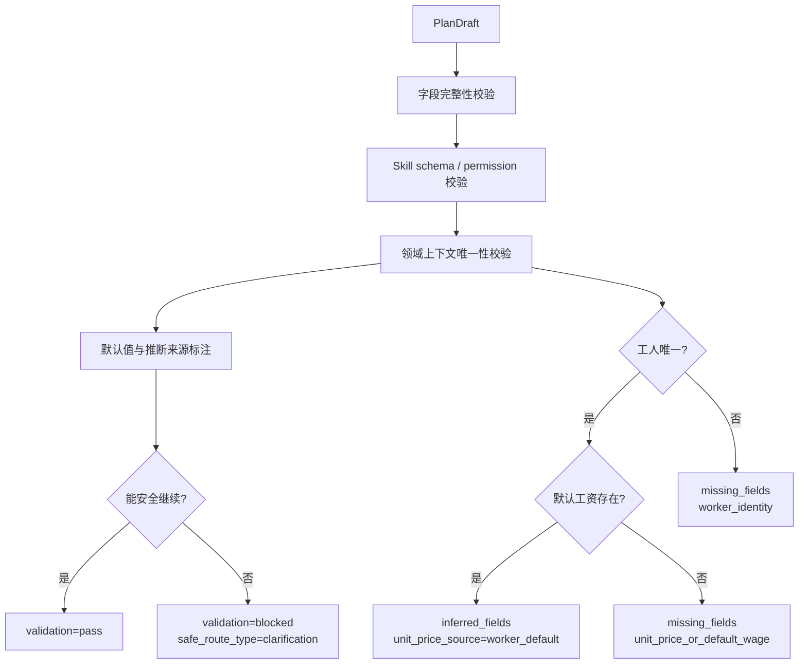
```mermaid
flowchart TD
    P["PlanDraft"] --> V1["字段完整性校验"]
    V1 --> V2["Skill schema / permission 校验"]
    V2 --> V3["领域上下文唯一性校验"]
    V3 --> V4["默认值与推断来源标注"]
    V4 --> V5{"能安全继续?"}
    V5 -->|是| PASS["validation=pass"]
    V5 -->|否| CL["validation=blocked<br/>safe_route_type=clarification"]

    V3 --> W1{"工人唯一?"}
    W1 -->|是| W2{"默认工资存在?"}
    W2 -->|是| INF["inferred_fields<br/>unit_price_source=worker_default"]
    W2 -->|否| MISS["missing_fields<br/>unit_price_or_default_wage"]
    W1 -->|否| MISS2["missing_fields<br/>worker_identity"]
```

典型校验：

| 对象 | 必要校验 |
| --- | --- |
| 工人 | 是否唯一、是否停用、是否有默认工资 |
| 地块/棚 | 是否唯一匹配、是否属于当前农场/茬口 |
| 茬口 | 是否活跃、是否唯一可推断 |
| 金额/工资 | 是否明确、是否可从默认工资推断、是否需要确认 |
| 写操作 | 参数非空、权限为 write_confirm、必须 pending |
| 多步骤 | 步骤顺序、依赖、每步参数完整 |

### 5.5 route_type 决策树

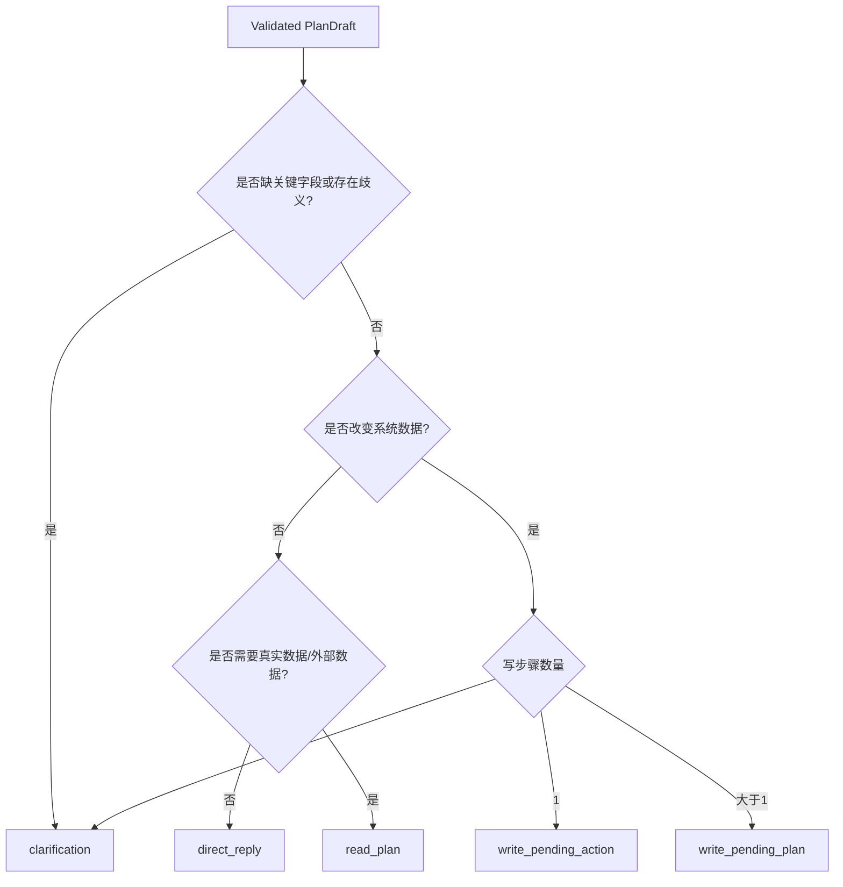
```mermaid
flowchart TD
    V["Validated PlanDraft"] --> A{"是否缺关键字段或存在歧义?"}
    A -->|是| C["clarification"]
    A -->|否| B{"是否改变系统数据?"}
    B -->|否| R{"是否需要真实数据/外部数据?"}
    R -->|否| D["direct_reply"]
    R -->|是| RP["read_plan"]
    B -->|是| W{"写步骤数量"}
    W -->|1| WA["write_pending_action"]
    W -->|大于1| WP["write_pending_plan"]
    W -->|0| C
```

这个决策树替代“某个 Skill 周边补丁”的长期方向：先决定计划类型，再决定工具和确认形态。

### 5.6 执行与确认生命周期

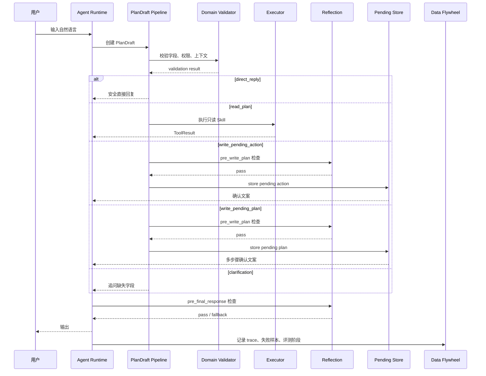
```mermaid
sequenceDiagram
    participant U as 用户
    participant A as Agent Runtime
    participant P as PlanDraft Pipeline
    participant V as Domain Validator
    participant E as Executor
    participant R as Reflection
    participant S as Pending Store
    participant D as Data Flywheel

    U->>A: 输入自然语言
    A->>P: 创建 PlanDraft
    P->>V: 校验字段、权限、上下文
    V-->>P: validation result
    alt direct_reply
        P-->>A: 安全直接回复
    else read_plan
        P->>E: 执行只读 Skill
        E-->>A: ToolResult
    else write_pending_action
        P->>R: pre_write_plan 检查
        R-->>P: pass
        P->>S: store pending action
        S-->>A: 确认文案
    else write_pending_plan
        P->>R: pre_write_plan 检查
        R-->>P: pass
        P->>S: store pending plan
        S-->>A: 多步骤确认文案
    else clarification
        P-->>A: 追问缺失字段
    end
    A->>R: pre_final_response 检查
    R-->>A: pass / fallback
    A-->>U: 输出
    A->>D: 记录 trace、失败样本、评测阶段
```

写操作二次生命周期：

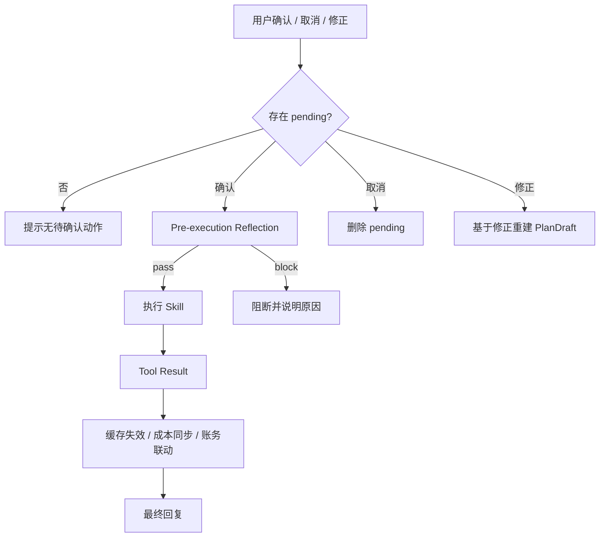
```mermaid
flowchart TD
    U["用户确认 / 取消 / 修正"] --> P{"存在 pending?"}
    P -->|否| N["提示无待确认动作"]
    P -->|确认| R["Pre-execution Reflection"]
    R -->|pass| E["执行 Skill"]
    R -->|block| B["阻断并说明原因"]
    E --> TR["Tool Result"]
    TR --> CR["缓存失效 / 成本同步 / 账务联动"]
    CR --> FR["最终回复"]
    P -->|取消| C["删除 pending"]
    P -->|修正| RB["基于修正重建 PlanDraft"]
```

### 5.7 多意图处理流程

多意图不是“让多个 Agent 自己协商”，而是单主 Agent 内部把一句话拆成多个 `PlanStep`，由 Validator 确认依赖关系。

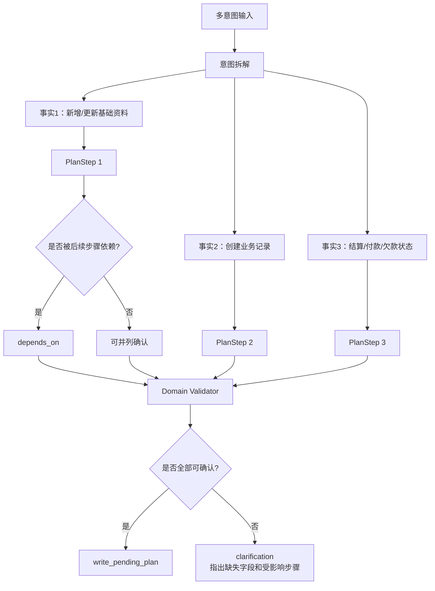
```mermaid
flowchart TD
    U["多意图输入"] --> D["意图拆解"]
    D --> F1["事实1：新增/更新基础资料"]
    D --> F2["事实2：创建业务记录"]
    D --> F3["事实3：结算/付款/欠款状态"]

    F1 --> S1["PlanStep 1"]
    F2 --> S2["PlanStep 2"]
    F3 --> S3["PlanStep 3"]

    S1 --> DEP{"是否被后续步骤依赖?"}
    DEP -->|是| LINK["depends_on"]
    DEP -->|否| PAR["可并列确认"]
    LINK --> V["Domain Validator"]
    PAR --> V
    S2 --> V
    S3 --> V
    V --> C{"是否全部可确认?"}
    C -->|是| PP["write_pending_plan"]
    C -->|否| CL["clarification<br/>指出缺失字段和受影响步骤"]
```

示例：

| 输入 | PlanStep | 结果 |
| --- | --- | --- |
| “新来一个工人李丽工资100一天，今天去6号棚收水稻” | `manage_workers` -> `create_operation_work_order` | pending plan |
| “李海这个月干了15天压瓜” | `create_operation_work_order` | pending action；默认工资可唯一确定才补单价 |
| “给李海记15天压瓜工资，每天180” | `manage_wages` 或追问是否创建作业单 | pending action / clarification |
| “把李海这笔工资结了” | `settle_labor_payment` | pending action，需要定位未付条目 |
| “删除这个工人再给他记工资” | destructive + write | clarification，不自动计划 |

### 5.8 失败阶段与数据飞轮

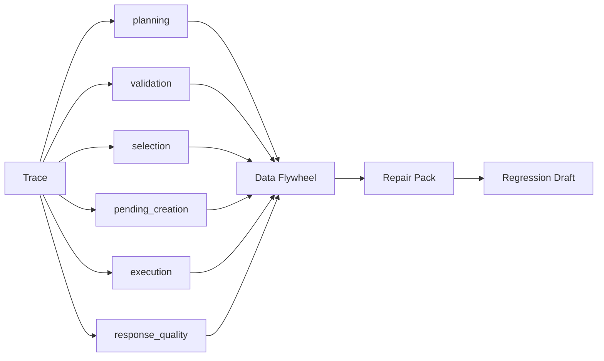
```mermaid
flowchart LR
    T["Trace"] --> P["planning"]
    T --> V["validation"]
    T --> S["selection"]
    T --> PC["pending_creation"]
    T --> E["execution"]
    T --> R["response_quality"]

    P --> DF["Data Flywheel"]
    V --> DF
    S --> DF
    PC --> DF
    E --> DF
    R --> DF

    DF --> RP["Repair Pack"]
    RP --> REG["Regression Draft"]
```

失败分类：

| 阶段 | 典型问题 | 修复方向 |
| --- | --- | --- |
| planning | 未识别多意图、实体拆错 | Planner schema / 语义样本 |
| validation | 缺字段却继续 pending | Domain Validator |
| selection | 选错 Skill 或漏选 | Router/Skill metadata |
| pending_creation | 空参数、确认文案不一致 | Pending/Reflection |
| execution | Skill 执行失败、DB 错误 | Skill/service |
| response_quality | 无工具却说已记录 | Reflection/prompt |

## 6. 计划触发规则

### 6.1 单写入

用户明确只做一件事，进入 pending action。

| 输入 | Skill | 行为 |
| --- | --- | --- |
| “记一笔化肥200元” | `create_cost_record` | 生成待确认记账 |
| “今天浇水了” | `log_farm_activity` | 生成待确认农事日志 |
| “李海工资日薪改成180” | `manage_workers` 或 `manage_wages` | 根据对象是工人档案还是工资记录澄清/确认 |

### 6.2 多意图写入

同一句包含多个可落库事实，生成 pending plan 或澄清。

| 输入特征 | 计划 |
| --- | --- |
| 新工人 + 作业 | `manage_workers` -> `create_operation_work_order` |
| 作业 + 工人 + 工资数量 | `create_operation_work_order`，必要时查询/使用默认日薪 |
| 工资记录 + 已付状态 | `manage_wages` 或 `settle_labor_payment`，不能混淆 |
| 删除 + 新增 | 默认澄清，不自动生成计划 |

### 6.3 计划不得触发

- 用户只是查询。
- 用户只表达意愿但没有对象，例如“帮我处理一下工人的事情”。
- 缺少写入关键字段，且系统无法从上下文唯一确定。
- 需要外部最新信息但没有对应 read tool 支撑。

## 7. Reflection 触发规范

Reflection 不负责“想出业务计划”，只负责守住边界。

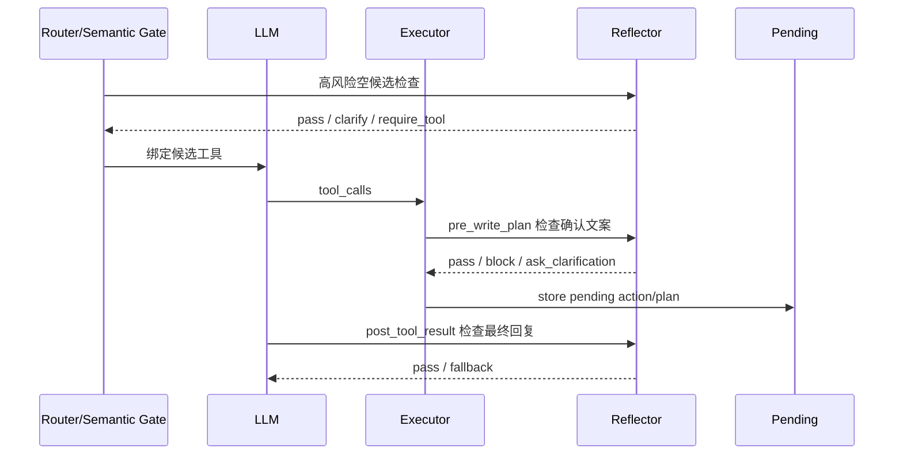
```mermaid
sequenceDiagram
    participant R as Router/Semantic Gate
    participant L as LLM
    participant E as Executor
    participant F as Reflector
    participant P as Pending

    R->>F: 高风险空候选检查
    F-->>R: pass / clarify / require_tool
    R->>L: 绑定候选工具
    L->>E: tool_calls
    E->>F: pre_write_plan 检查确认文案
    F-->>E: pass / block / ask_clarification
    E->>P: store pending action/plan
    L->>F: post_tool_result 检查最终回复
    F-->>L: pass / fallback
```

必须触发：

| 触发点 | 目的 |
| --- | --- |
| router 后：写入成功话术风险 | selected_tools 为空但输入像写入时，禁止直接成功回复 |
| pending action 前 | 检查确认文案与参数一致 |
| pending plan 前 | 检查步骤数量、依赖、空参数 |
| tool result 后 | 工具失败时禁止最终回复成功 |
| final response 前 | 已选工具但未调用时 fail-closed |

不应触发：

- 问候、闲聊。
- 已明确安全降级的回复。
- 纯只读且不包含业务事实承诺的回复。

## 8. Skill 触发树

触发树按“先分流、再选域、最后选 Skill”的方式阅读。不要把所有 Skill 塞进一张图；全量细节用分图承载。

### 8.1 总入口分流

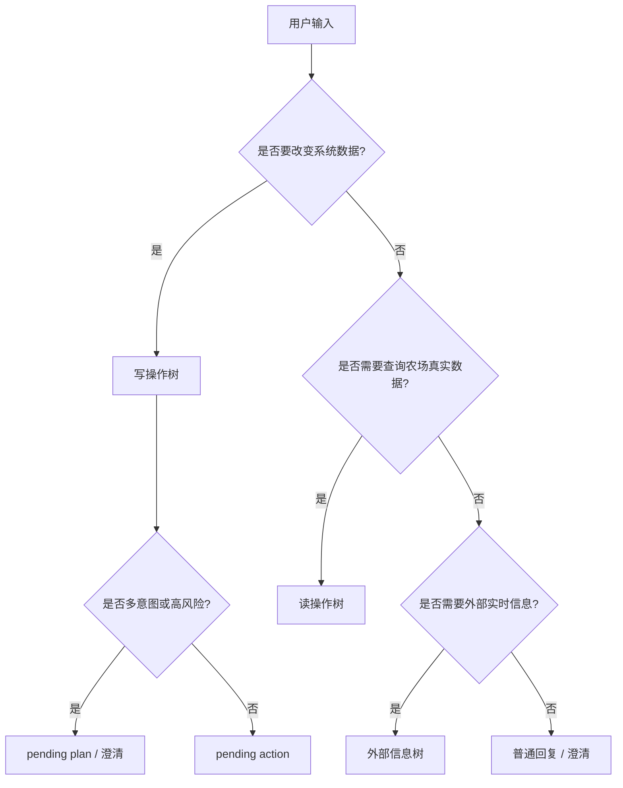
```mermaid
flowchart TD
    U["用户输入"] --> A{"是否要改变系统数据?"}
    A -->|是| W["写操作树"]
    A -->|否| B{"是否需要查询农场真实数据?"}
    B -->|是| R["读操作树"]
    B -->|否| C{"是否需要外部实时信息?"}
    C -->|是| E["外部信息树"]
    C -->|否| N["普通回复 / 澄清"]

    W --> P{"是否多意图或高风险?"}
    P -->|是| PP["pending plan / 澄清"]
    P -->|否| PA["pending action"]
```

### 8.2 写操作树

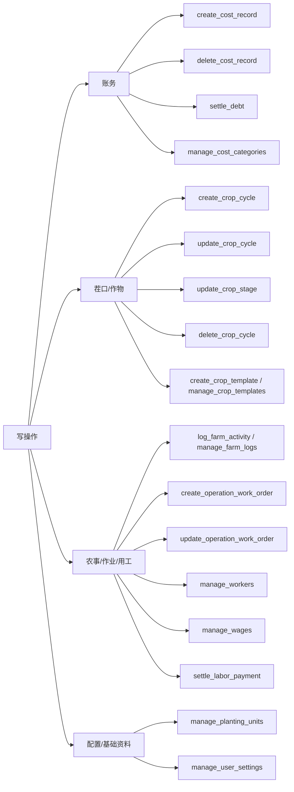
```mermaid
flowchart LR
    W["写操作"] --> Finance["账务"]
    W --> Planting["茬口/作物"]
    W --> Ops["农事/作业/用工"]
    W --> Admin["配置/基础资料"]

    Finance --> F1["create_cost_record"]
    Finance --> F2["delete_cost_record"]
    Finance --> F3["settle_debt"]
    Finance --> F4["manage_cost_categories"]

    Planting --> P1["create_crop_cycle"]
    Planting --> P2["update_crop_cycle"]
    Planting --> P3["update_crop_stage"]
    Planting --> P4["delete_crop_cycle"]
    Planting --> P5["create_crop_template / manage_crop_templates"]

    Ops --> O1["log_farm_activity / manage_farm_logs"]
    Ops --> O2["create_operation_work_order"]
    Ops --> O3["update_operation_work_order"]
    Ops --> O4["manage_workers"]
    Ops --> O5["manage_wages"]
    Ops --> O6["settle_labor_payment"]

    Admin --> A1["manage_planting_units"]
    Admin --> A2["manage_user_settings"]
```

### 8.3 读操作树

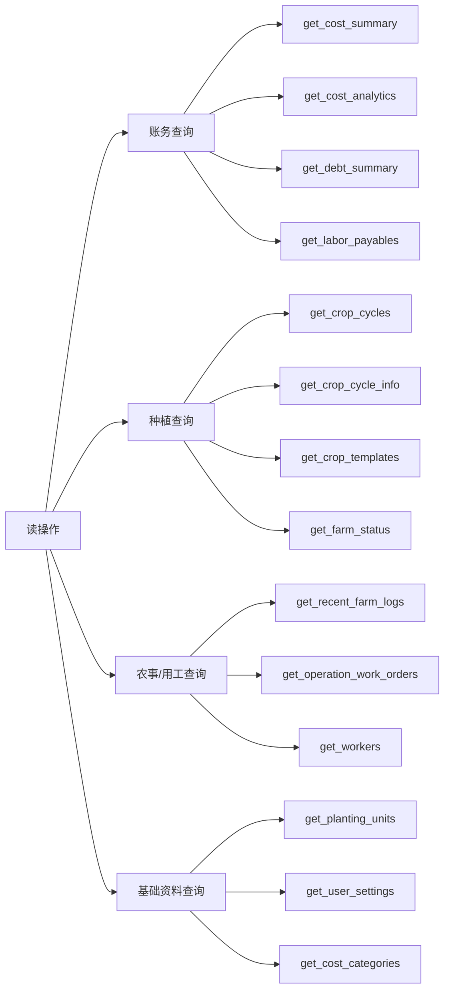
```mermaid
flowchart LR
    R["读操作"] --> Finance["账务查询"]
    R --> Planting["种植查询"]
    R --> Ops["农事/用工查询"]
    R --> Admin["基础资料查询"]

    Finance --> F1["get_cost_summary"]
    Finance --> F2["get_cost_analytics"]
    Finance --> F3["get_debt_summary"]
    Finance --> F4["get_labor_payables"]

    Planting --> P1["get_crop_cycles"]
    Planting --> P2["get_crop_cycle_info"]
    Planting --> P3["get_crop_templates"]
    Planting --> P4["get_farm_status"]

    Ops --> O1["get_recent_farm_logs"]
    Ops --> O2["get_operation_work_orders"]
    Ops --> O3["get_workers"]

    Admin --> A1["get_planting_units"]
    Admin --> A2["get_user_settings"]
    Admin --> A3["get_cost_categories"]
```

### 8.4 外部信息树

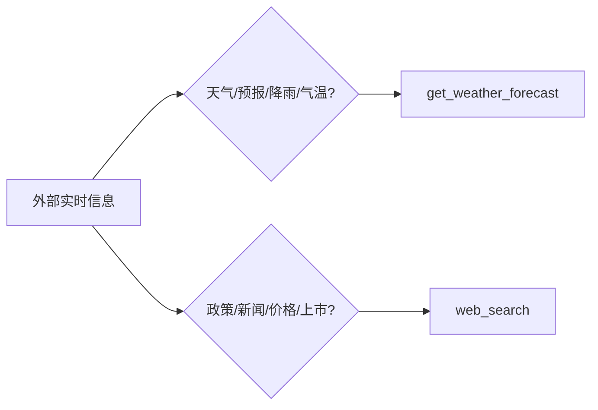
```mermaid
flowchart LR
    E["外部实时信息"] --> Weather{"天气/预报/降雨/气温?"}
    E --> Search{"政策/新闻/价格/上市?"}
    Weather --> W1["get_weather_forecast"]
    Search --> S1["web_search"]
```

### 8.5 农事与用工子树

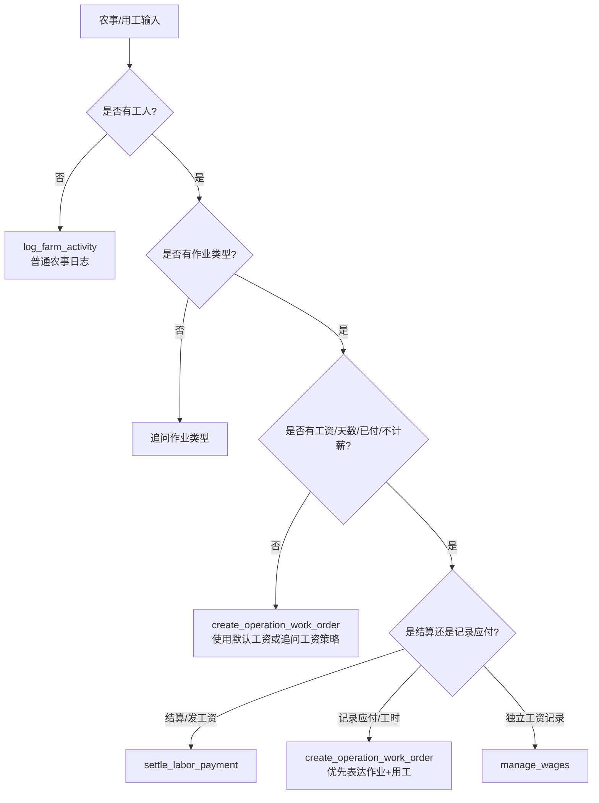
```mermaid
flowchart TD
    X["农事/用工输入"] --> Q1{"是否有工人?"}
    Q1 -->|否| LFA["log_farm_activity<br/>普通农事日志"]
    Q1 -->|是| Q2{"是否有作业类型?"}
    Q2 -->|否| CL1["追问作业类型"]
    Q2 -->|是| Q3{"是否有工资/天数/已付/不计薪?"}
    Q3 -->|否| COWO1["create_operation_work_order<br/>使用默认工资或追问工资策略"]
    Q3 -->|是| Q4{"是结算还是记录应付?"}
    Q4 -->|结算/发工资| SLP["settle_labor_payment"]
    Q4 -->|记录应付/工时| COWO2["create_operation_work_order<br/>优先表达作业+用工"]
    Q4 -->|独立工资记录| MW["manage_wages"]
```

判断原则：

| 句子 | 主 Skill | 说明 |
| --- | --- | --- |
| “今天浇水了” | `log_farm_activity` | 无工人、无工资 |
| “李海这个月干了15天压瓜” | `create_operation_work_order` | 作业 + 用工 + 计薪数量 |
| “给李海记15天工资” | `manage_wages` | 独立工资记录，无作业单语义 |
| “把李海工资结了” | `settle_labor_payment` | 支付/结算已有未付人工 |
| “李海日薪改成180” | `manage_workers` | 修改工人档案默认日薪 |

## 9. Skill 理论约束

Skill 是原子能力，不是 Agent。

| 层级 | 允许做什么 | 禁止做什么 |
| --- | --- | --- |
| Skill | 校验参数、调用 service、返回结构化结果 | 自己决定下一步调用其他 Skill |
| Router | 选择候选 Skill、生成意图帧 | 执行业务写入 |
| Pending Plan | 串联多个写操作的确认展示 | 在未确认前执行 |
| Reflector | 阻断不一致、失败成功话术、空计划 | 替代业务 parser |
| Data Flywheel | 收集失败样本、生成修复包 | 未经确认直接改生产逻辑 |

## 10. 不过度设计的落地阶段

### Phase 1：修补识别与守门

只做三件事：

1. 给农事/用工句补规则识别，例如“人名 + 干了/做了 + 数量 + 作业类型”。
2. final 前增加成功写入话术守门：即使 selected_tools 为空，也不能放行“已记录/已创建/已保存”。
3. 为该类输入补路由回归。

验收：

- “李海这个月干了15天压瓜”不再直接成功回复。
- 至少进入 `create_operation_work_order` pending 或明确追问缺失字段。
- 不影响普通查询和闲聊。

### Phase 2：轻量多意图计划

复用 `IntentFrame` 和 `pending_plan`，只支持确定性场景：

- 新工人 + 作业。
- 作业 + 用工 + 明确工资。
- 作业 + 用工 + 默认工资可唯一确定。

验收：

- pending plan 步骤数量与确认文案一致。
- 写步骤参数非空。
- 无法唯一确定时追问。

### Phase 3：数据飞轮闭环

把失败输入沉淀为修复包：

- `wrong_tool_selection`
- `pending_missed`
- `hallucinated_execution`
- `tool_error_ignored`

验收：

- repair pack 先输出问题列表，用户确认后再修复。
- regression draft 不再为空断言。

## 11. 回归用例种子

| 用例 | 期望 |
| --- | --- |
| 李海这个月干了15天压瓜 | `create_operation_work_order` 或澄清，不得直接“已记录” |
| 今天李海去6号棚压蔓工资100一天 | `create_operation_work_order`，worker 不得抽成“号棚压蔓” |
| 新来一个工人李丽工资100一天，今天去6号棚收水稻 | pending plan: `manage_workers` -> `create_operation_work_order` |
| 给李海记一笔15天压瓜工资，每天180 | `manage_wages` 或确认是否创建作业单 |
| 把李海这笔工资结了 | `settle_labor_payment`，需要定位未付条目 |

## 12. 成功标准

| 指标 | 目标 |
| --- | --- |
| 写操作绕过率 | 0 |
| selected_tools 为空但成功写入话术 | 0 |
| 农事+用工句路由准确率 | >= 0.95 |
| pending plan 空参数率 | 0 |
| 反思误拦截闲聊率 | <= 0.02 |
| 修复包 regression draft 空断言率 | 逐步降到 0 |

## 13. 相关文件

- `backend/app/agent/router/classifier.py`
- `backend/app/agent/router/policy.py`
- `backend/app/agent/runtime/nodes.py`
- `backend/app/agent/runtime/reflection.py`
- `backend/app/agent/runtime/tool_executor.py`
- `backend/app/agent/reflector/checks.py`
- `backend/app/infra/pending_actions.py`
- `backend/app/agent/skills/*/skill.md`
